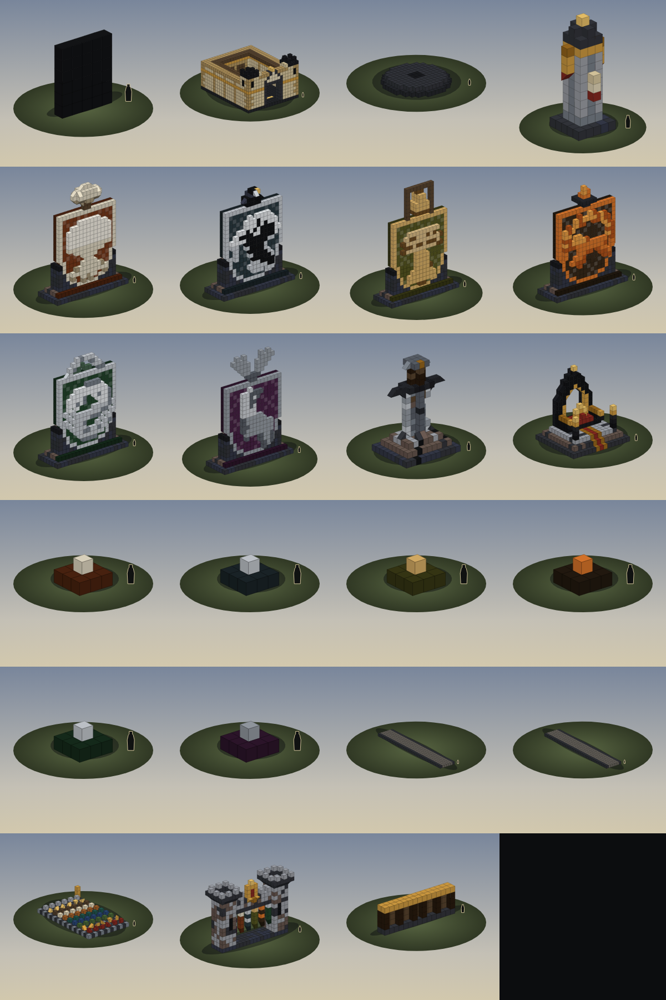
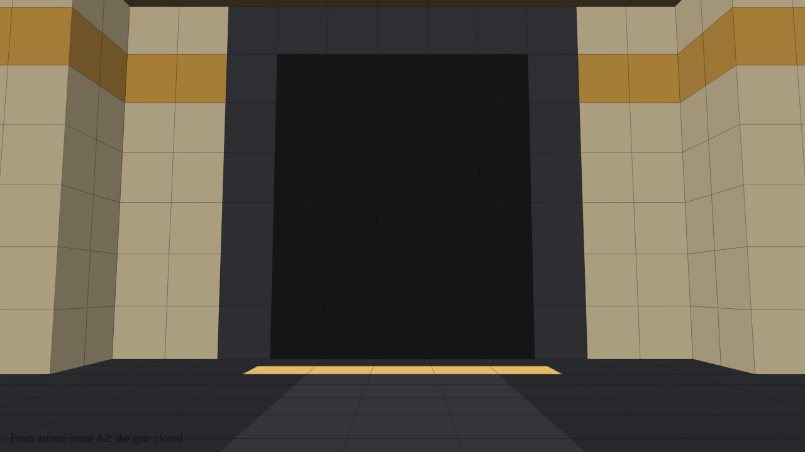
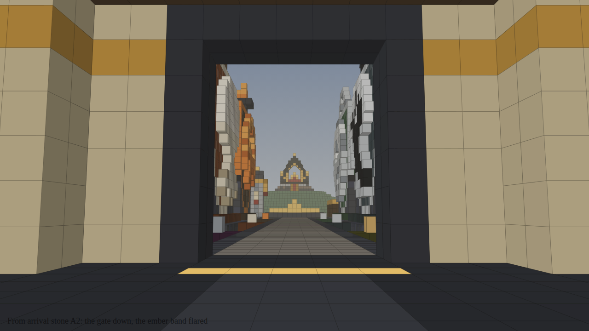
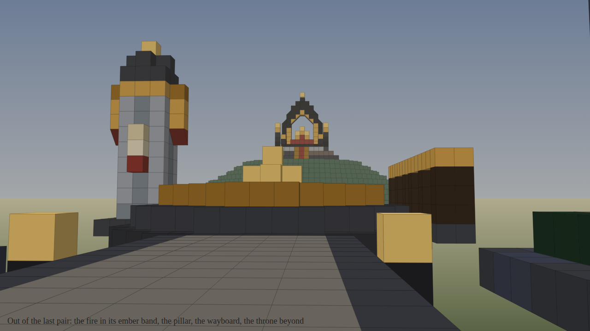
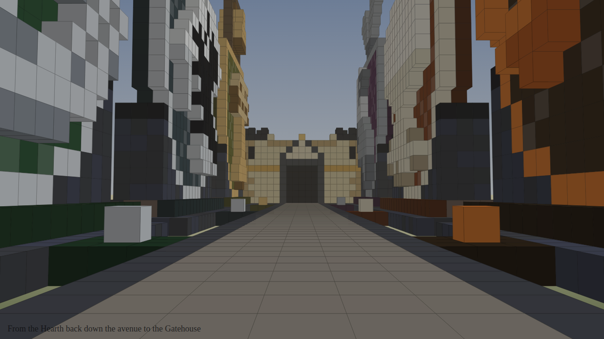
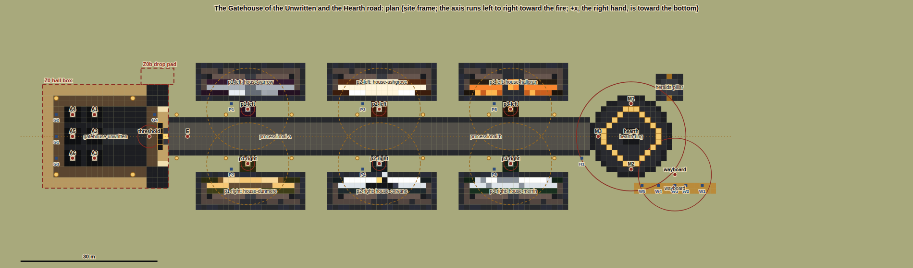

# Realm sculptures

Realm's own monuments, built from the game's ordinary building blocks so they can stand in the real world and every
player sees them. Each one is generated by code in `src/`, written to `<id>.json` and previewed in `preview/`. The
server plugin `plugins/RealmSculptor.cs` places, paints, protects and removes them; its guide is
[`plugins/docs/RealmSculptor.md`](../../plugins/docs/RealmSculptor.md), which also lists what is still UNVERIFIED in game.

| Id | Sculpture | Blocks | Size (blocks) | Height |
|---|---|---|---|---|
| `heralds-pillar` | **Herald's Pillar.** A fluted stone column with a parchment notice and red seal, gold pennants, a gold capital and a brazier. The first piece to place on a real server. | 132 | 5 x 13 x 5 | 15.6 m |
| `ironbreaker` | **The Ironbreaker.** A colossal slab greatsword of siege iron, blunt and chipped, its grip wrapped in two leathers, driven point-first into a stepped plinth that cracked and heaved around it. | 304 | 11 x 16 x 9 | 19.2 m |
| `old-throne` | **The Old Throne.** After the realm emblem (`art/logo/realm-emblem.svg`): black stone, a pointed arch rimmed in gold, the crown resting on its red cushion inside the arch, three steps with a red runner, two braziers. | 628 | 15 x 16 x 13 | 19.2 m |
| `house-varrow` ... `house-merrin` | **The six house monuments.** The house's heater shield in its field colour with the charge from `art/sigils/<house>.svg` standing out one block in the house metal, held in a stone cradle, with a crest of its own on top: antlers, an oak crown, a perched raven, a hung bell, an ember brazier, a leaping eel. | 1044-1118 | 20 x 24-28 x 7 | 29-34 m |
| `tournament-arch` | **The Tournament Arch.** Two crenellated towers and a beam hung with the six house banners, riders passing under them, the tournament's gold-rimmed red shield on top. | 674 | 21 x 15 x 6 | 18.0 m |
| `shape-test` | **Shape test** (not a monument): every single-block shape in six rotations, to compare the game's real shapes with what the tools assume. | 336 | 13 x 4 x 21 | |
| `gatehouse-unwritten` | **The Gatehouse of the Unwritten** ([arrival site](#the-arrival-site)). A walled court of pale stone: Parchment 2 walls two thick and nine high with an Ember string course and pale-edged piers, two corner towers with Iron 800 caps and arrow slits, wooden eaves two cells in from the wall tops, a dark cobbled floor with six identical Parchment arrival stones in Iron 900 borders, a lighter aisle and an Ember hot gold line before the gate, the Chronicle Wall (three dark boards for signs) on the back wall, and over the gate, inside and out, a pointed tympanum of blank parchment with a gold keystone. The Pilgrim's Stair in the left tower climbs to a sill in the outer wall. The 5 x 6 gate gap is left empty. | 1888 | 19 x 13 x 23 | 15.6 m |
| `gatehouse-portcullis` | **The portcullis**: 30 reinforced cells in Iron 900. Never placed with `/sculpt`: RealmArrival builds it and takes it down row by row. | 30 | 5 x 6 x 1 | 7.2 m |
| `processional-a`, `processional-b` | **The Processional**: the 7-wide road from the gate to the Hearth ring, unpainted cobbles between Iron 600 kerbs. Optional (flat ground only). | 273, 266 | 7 x 1 x 39, 7 x 1 x 38 | |
| `pledge-stone-<house>` | **Pledge stones**: a 3 x 3 plinth in the house's dark field with a raised centre in its metal. | 10 | 3 x 2 x 3 | |
| `hearth-ring` | **The Hearth ring**: the raised round dais of the Hearth fire, an Iron 700 outer step and an Iron 600 dais with an Iron 800 hearthstone for the staff fire pit. The ember band's 24 cells are left empty on top of it for RealmArrival. | 314 | 15 x 2 x 15 | 2.4 m |
| `wayboard` | **The wayboard**: an Iron 600 base, spruce posts and boards in Ink and Ink soft, an Ember rail, five bays for signs. | 123 | 15 x 5 x 2 | 6.0 m |



Every sculpture has four previews: `front`, `three-quarter`, `side` (painted) and `unpainted` (three-quarter, each
material in a guess at its own colour, which is what players see if a material does not take paint). A 1.8 m figure
stands beside each for scale. The previews show block cells and the shapes the tools *assume*; they do not show the
game's textures or light.

## Making and changing sculptures

```
node art/tools/sculptor/cli.mjs build [id...]     # run src/*.mjs, write <id>.json
node art/tools/sculptor/cli.mjs preview [id...]   # PNGs in preview/ (headless Chromium)
node art/tools/sculptor/cli.mjs check             # valid, up to date with its generator, previewed
node art/tools/sculptor/cli.mjs info              # block counts by material and shape
node art/tools/sculptor/cli.mjs masks             # re-rasterise src/sigil-masks.json from art/sigils
node art/tools/sculptor/cli.mjs export <oxide/data folder>   # copy every sculpture to <folder>/RealmSculptor/
node art/tools/sculptor/cli.mjs site <id> [--anchor x,y,z] [--turn 0-3]   # a site's run-sheet on the ground
node --test art/tools/sculptor/test/*.test.mjs
```

A generator in `src/` exports `{ id, name, description, build() }` (or a list of them) and builds a `Grid` with the
helpers in `src/lib/kit.mjs`: named styles (`ST.stoneLight`, `ST.steel`, `ST.gold`, ...), `ramp()`, `stepped()`, and
`Grid.sample()`, which turns any solid described as a function into blocks and fits ramps where a surface slopes.
Everything is deterministic. Colours are always palette colours (`art/palette.json`); materials are named by role
(`art/tools/sculptor/materials.json`).

Rules the checker enforces: at most 4000 blocks and 64 per side; only single-block shapes; every block face-connected
to the bottom layer (the game drops floating chunks); blocks written bottom-up; a licence and a source.

## Models from elsewhere

`node art/tools/sculptor/cli.mjs voxelize <model.obj|.gltf|.glb> --id <id> --name "<name>" --height 12
--license CC0-1.0 --source <url>` turns a closed mesh into a sculpture, with ramps on slopes and colours quantised
to the palette. Only CC0 or similarly permissive models, with the source URL (and a `--credit` line for CC BY);
the checker refuses third-party work without them. No third-party model is in this folder.

## File format (`realm-sculpture/1`)

```json
{
  "format": "realm-sculpture/1", "id": "heralds-pillar", "name": "Herald's Pillar", "description": "...",
  "size": [5, 13, 5], "front": "-z", "materials": { "1": "cobblestone", "2": "stone" },
  "license": "realm-original", "source": "art/sculptures/src/heralds-pillar.mjs",
  "blocks": [[x, y, z, materialId, prefabId, rotationIndex, "#rrggbb"], ...]
}
```

`y` is up, the front faces `-z`, one cell is one game block (1.2 m). `prefabId` 0 is a plain block; 1-9 and 15 are
the game's other single-block shapes; `rotationIndex` indexes the game's table of 24 block rotations
(`art/tools/sculptor/rotations.mjs`). The colour may be `null` to keep the material's own look.

## The arrival site

`sites/arrival.json` lays out the arrival of [`docs/arrival-design.md`](../../docs/arrival-design.md) (section 4):
the Gatehouse, the processional between the six house monuments in three facing pairs with their pledge stones, the
Hearth ring with the ember band, the Herald's Pillar and the wayboard, on one axis from the gate to the fire to the
Old Throne. It is made by `src/sites/arrival.mjs` from the geometry in `src/lib/arrival-site.mjs`, which the pieces'
generators share, so the pieces and the layout cannot disagree.

| Reveal from arrival stone A2, gate closed | The gate down, the band flared |
|---|---|
|  |  |
| **Out of the last pair** | **Back down the avenue** |
|  |  |



The other views are `site-arrival-threshold`, `-court`, `-avenue`, `-hearth`, `-aerial`, `-aerial-gate` and `-side`.
The Old Throne on its hill and the fire in the pit are stand-ins in the previews only (`context` pieces and
`terrain`); nothing places them.

Choices the design left open, and why:

- **The hearth ring is a raised dais, and the ember band stands on it** (the band's cells are at the Hearth centre's
  feet height, y 2). Flush with the ground, or behind seating as high as itself, the band could not be seen from the
  gate: the previews showed it hidden at 100 m. One block proud of the dais, it rings the fire as a low parapet and
  shows through the gate. The staff fire pit stands on the hearthstone in the middle, so its flames show too.
- **The Herald's Pillar and the wayboard stand beside the ring, not on the axis.** On the axis (the design's sketch
  has the pillar at L 141 and the wayboard across the road at L 146) they covered the Old Throne in the view from the
  gate. Now the pillar stands left of the ring on the throne side and the wayboard right of it, its five bays facing
  the axis, and the two frame the throne.
- **The Gatehouse's front towers are its corners**, so the Pilgrim's Stair can go up inside the left one to a sill in
  the left wall (a 1-cell step up onto a landing; the top of the sill is 2 cells, 2.4 m, above the ground outside, over
  the drop pad, as the design asks).
- Two small additions inside the court, both in palette colours already on the piece: a lighter Iron 600 aisle in the
  floor from the front stones to the gold line, and the Chronicle Wall: three Ink soft boards in a Parchment edge
  frame where signs G1-G3 hang.

All of it is UNVERIFIED in game, like every sculpture: the materials, the colours, whether 2-cell eaves stand under
the game's block collapsing (fallback: remove them), whether the sill can be climbed from outside (play-test 6b) and
whether the band shows from 100 m (play-test 6). `node art/tools/sculptor/cli.mjs site arrival --anchor x,y,z
--turn 0-3` prints the run-sheet for a real anchor: every stand spot, facing and `/sculpt place` command in route order,
and every point in world cells.

## Site layouts (`realm-site/1`)

A site places several sculptures relative to one anchor and names the cells, points, boxes, zones and sign spots a
plugin or a run-sheet needs. Sites live in `sites/<id>.json`, written by `node art/tools/sculptor/cli.mjs build`
from `src/sites/<id>.mjs` (a module exporting `{ id, name, description, previews, build(sculptures) }`); `check`
fails if a site is invalid, out of date or not previewed, and `preview <id>` renders its views
(`art/tools/sculptor/site-render.mjs`). The code is `art/tools/sculptor/site.mjs`.

**Units and frame.** Every coordinate is a block cell (`cellMetres`, 1.2 m), the same grid as `RootCubeGrid`'s local
cells. `y` is up. A site has its own frame (described in `frame`); the arrival site's `x` is across the axis, `+x` on
the right of someone walking from the gate to the fire, and `z` runs along the axis from the back wall. Every piece's
bottom layer is `y` 0, which is the cell an admin's feet are in on bare ground (RealmSculptor builds a piece's bottom
layer there).

**Placing a site on the ground.** Choose an anchor (the world cell for site cell `[0, 0, 0]`) and a turn `R`
(quarter-turns about the vertical, as `/sculpt place` turns, `plugins/RealmSculptor.cs` `TurnXZ`). Then

    world cell = anchor + turn(site cell, R)      where turn([x, y, z], 1) = [z, y, -x]

and a site cell's world position in metres is `((wx + 0.5) * 1.2, wy * 1.2, (wz + 0.5) * 1.2)` for a point a player
stands at (the middle of the cell's floor). A piece's world turn is `(turn + R) mod 4`. `resolveSite()` and the
`site` command do all of this.

| Field | What it holds |
|---|---|
| `format`, `id`, `name`, `description`, `source`, `design`, `cellMetres`, `frame` | Identity, the generator, the design document, the cell size, and the frame in words. |
| `lot` | For pieces whose house is drawn by lot: `slots` (six), `houses`, the `rule`, and `preview` (the draw the previews show). A piece with a `slot` names its sculpture with `{house}`, filled from the draw. |
| `pieces[]` | `key`; `sculpture` (an id in this folder, maybe with `{house}`); `by`: `sculptor` (placed with `/sculpt place`), `plugin` (cells a plugin places itself, never with `/sculpt`) or `context` (preview only); `slot`; `turn` (0-3, the piece's quarter-turns in the site frame); `at` (the site cell of the corner of its turned footprint, lowest x, y, z); `size` (`[wx, height, wz]` after turning; for a slot, the largest of the houses); `order` (route order for `/sculpt`); `stand` (`cell` the admin's feet are in, `facing` `+z`, `+x`, `-z` or `-x`, and the `command`) so that, with the default `DistanceAhead` 2, RealmSculptor builds the piece exactly at `at`; `optional`; `note`. Every stand spot is on bare ground when its piece is placed (the checker refuses one on an earlier piece). |
| `cells` | Named cell groups. `gate`: the portcullis as `rows`, **top row first**, each **left to right as seen from the court**; with `piece` (the plugin-owned piece they are), `owner`, `command`, `material` (a RealmSculptor role) and `colour`. `emberBand`: the 24 band `cells` (from the avenue side round through +x, anticlockwise seen from above), `centre` (equal to `points.hearth`), `radius`, the `rule` that generates them from the centre, `material`, `rest` and `flare` colours, `restsOn` (the piece under them). `goldLine` and `stoneFloors`: cells of the gatehouse (the inlays; `stoneFloors` is what a self-check reads with `GetCubeInfoAtLocal`). |
| `points` | Named points, each a `cell` (the cell a player's feet are in) and a `kind`: `stone` (A1-A6), `trigger` (`threshold`, `wayboard`), `gate` (`gateSet`: where an admin stands for `/arrival admin gate set 5 6`, the bottom-left cell of the empty opening, facing out), `eject` (`E`), `banner` (`banner.<slot>`, on the raised centre of the pledge stone; the house is the one drawn for the slot), `fire` (`hearth`), `mercy` (M1-M3) and `exit` (`pilgrimLedge`). The checker requires a floor under each and two clear cells (not for `fire` and `gate`). |
| `boxes` | `Z0` (hall box) and `Z0b` (drop pad): `min` and `max` cells, inclusive. |
| `zones[]` | The design's zones by `key` (`Z0` ... `Z5`, `corridor`): a `box`, or a `point` (`banner.*` means each banner point) with `radiusM` in metres, `dwellSeconds`, or an `axis` (two cells) with `halfWidthM`. |
| `signs[]` | Sign spots for staff: `key` (G1-G4, P1-P6, W1-W5, H1), the clear `cell` the sign stands in, `faces` (`+x`, `-x`, `+z`, `-z`), the `/paint` `binding`, the notice `text` (under 180 characters), `slot` for house signs, `note`. |
| `terrain[]` | Preview-only ground: `mound` (the throne hill stand-in) and `fire` (the fire pit stand-in). Never built. |

For RealmArrival: the points and boxes are what `/arrival admin ...` stores where staff stand, so the file says where
those spots are and lets a test compare the stored points with the plan; `cells.gate.rows` and `cells.emberBand.cells`
are the exact cells `gate build` and `beacon build 5` should write, relative to the stored gate cell and Hearth
centre (`gate.rows[5][0]` is the gate-set cell; the band is the Hearth centre plus the offsets in `rule`).
