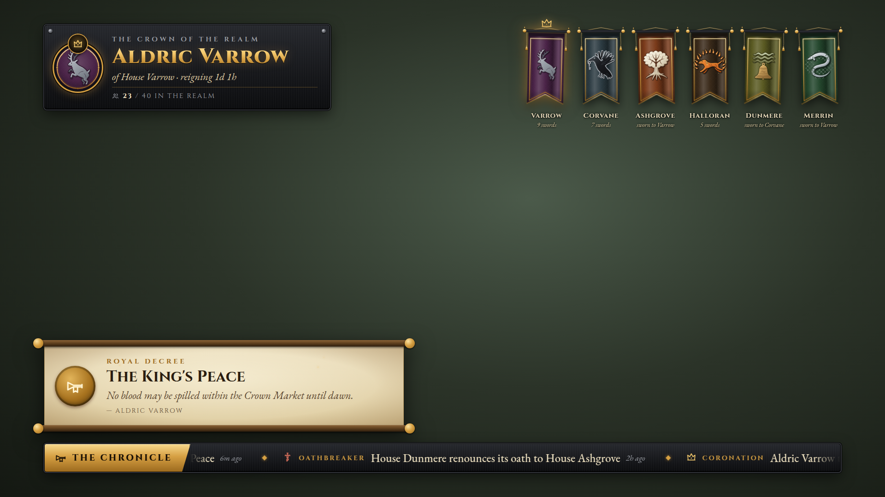

# Realm Chronicle service

A small local web service that turns the data files written by the `RealmChronicle` Oxide plugin into:

- `GET /api/state`: the crown, the houses, and the online count
- `GET /api/events`: the chronicle feed
- `/overlay`: a transparent 1920x1080 OBS browser source showing the crown, house banners, a ticker and animated proclamations
- `/realm`: a public chronicle page under the key art of the Old Throne, with the crown (and the ruling house's sigil), the great houses' banners and a filterable timeline on parchment

It has no dependencies; it uses only Node 20+ built-ins (tested on Node 22). It only ever **reads** the data directory and never writes to it. The pages need no internet: the fonts (OFL Cinzel and EB Garamond) and the Realm art pack are served from `public/assets/fonts` and `public/assets/art`, copies made by `node portal/scripts/sync-art.mjs` (edit `art/`, never the copies).



More screenshots (sample data, rendered by `streamkit/tools/chronicle-shots.mjs`): `docs/img/overlay-coronation.png`, `overlay-rebellion.png`, `overlay-transparent.png`, `realm-desktop.png`, `realm-mobile.png`.

## Running it on the server PC (Windows)

```powershell
cd <repo>\chronicle
# default data dir: G:\RealmTest\server\oxide\data  (the test copy made by server\New-TestServer.ps1)
node server.js
# or point it elsewhere, e.g. if Oxide put its folder under Saves\:
$env:REALM_DATA_DIR = "G:\RealmTest\server\Saves\oxide\data"
node server.js
```

Then open `http://127.0.0.1:8787/realm`.

**Check the data path.** Oxide creates `oxide\` under the server's working directory, or under the path given to `-oxide.directory` (docs/oxide-rok-api.md, section 6.4). One community note says it goes under `Saves\oxide\` instead (docs/server-reference.md, section 6). Point `REALM_DATA_DIR` at whichever folder actually contains `RealmChronicle.json` once the plugin has run. `GET /healthz` reports `missing` while the service cannot find the files.

| Option | Env var | Flag | Default |
|---|---|---|---|
| Data dir | `REALM_DATA_DIR` | `--data <dir>` | `G:\RealmTest\server\oxide\data` (the test copy) |
| Bind address | `HOST` | `--host` | `127.0.0.1` (local only) |
| Port | `PORT` | `--port` | `8787` |
| Stale after (s) | `REALM_STALE_SECONDS` | `--stale` | `180` (`0` turns the check off) |

The service binds to loopback by default, so no firewall or router changes are needed. Binding to anything else prints a warning. Do that only on purpose, for example behind a reverse proxy, once the public page is wanted.

### Try it with the sample data

```bash
npm run sample      # node server.js --data sample-data --stale 0
npm test            # node:test smoke tests against sample-data
```

## OBS setup

1. Add a **Browser** source with URL `http://127.0.0.1:8787/overlay`, width `1920` and height `1080`.
2. Leave the custom CSS empty. The page background is already transparent.
3. The stage scales to fit any source size with a 16:9 aspect.

Overlay query options:

| Param | Effect |
|---|---|
| `banners=N` | Show up to N house banners (default 6, max 8); `0` hides them |
| `ticker=0` / `crown=0` / `proclaim=0` | Hide the ticker, the crown plate, or the proclamation cards |
| `hold=S` | How long each proclamation stays up, in seconds (default 12) |
| `poll=S` | Event poll interval, in seconds (default 3) |
| `replay=1` | Proclaim the latest event on load (useful for positioning). `replay=coronation` or `replay=rebellion_started` plays the latest event of that type, to rehearse the big moments |
| `moments=0` | Show coronations and rebellions as ordinary proclamations instead of taking the centre of the screen |
| `motion=0` | No decorative motion (turning rays, sparks, swaying banners, the scrolling ticker). Moments and proclamations still appear. The system's reduced-motion setting does the same |
| `bg=1` | Dim backdrop for previewing in a normal browser. Do not use it in OBS. |

New events appear as an unrolling parchment proclamation with the event's own icon on a wax seal (a season's medal or a renown title's badge when there is one) and embers, and are added to the scrolling ticker. A change of king makes the crown plate flare. If the plugin stops refreshing `RealmState.json`, the crown plate shows "The ravens are late".

Two events take the centre of the screen for about ten seconds:

- **Coronation.** Light rays turn behind the new monarch's house banner as it unfurls, the crown drops onto it and flashes, sparks burst, then "Long live the crown", the monarch's name, the house and its words.
- **Rebellion.** The edges of the frame pulse blood red, a blade of light cuts across, the rebel house's shield and the crossed swords slam in and shake, then the headline.

The six great houses of the lore show their drawn banners, sigils and shields from the art pack; a house a player founds keeps its dyed banner with its initial. Everything with text stays inside the 1080p title-safe area (96 px at the sides, 54 px top and bottom). **UNVERIFIED in OBS itself:** add the overlay as a browser source and play `replay=coronation`, then `replay=rebellion_started`, to see both moments over the game.

## API

`GET /api/state` returns the `RealmState.json` contract, with only whitelisted fields, plus `stale`:

```json
{ "king": "Aldric Varrow", "house": "Varrow", "since": "2026-09-30T19:42:10Z",
  "houses": [{ "name": "Varrow", "sigil": "Iron Stag", "liege": null, "members": 9 }],
  "online": 23, "maxPlayers": 40, "updated": "2026-10-01T21:05:00Z",
  "next": { "title": "Rebellion window", "at": "2026-10-03T19:00:00Z" }, "stale": false }
```

`next` is the soonest scheduled realm event that has not started yet, or `null`. `title` is a non-empty string of at most 80 characters and `at` is a UTC ISO 8601 time. A `next` with a longer title, a missing title or an unparseable time is served as `null`. The service does not drop past times itself; clients such as the Realm player app should ignore an `at` that has already passed.

`GET /api/events` returns an array of `{id, ts, type, title, detail, actors[]}`:

- With no `since`, it returns the latest `limit` events (default 50, max 500), oldest first.
- `?since=<id>` returns events with `id > since`, oldest first, up to `limit`. Poll with the last id you saw.
- A non-integer `since` returns 400.
- Unknown event types and extra fields are dropped. Timestamps without a zone are read as UTC.
- The known types are `EVENT_TYPES` in `server.js`. That set must equal `KnownTypes` in `plugins/RealmChronicle.cs` and the keys of `TYPE_META` in `public/assets/common.js`; `npm test` fails if they drift apart. The contract types are `contract_posted`, `contract_fulfilled` and `contract_ended`, written by `plugins/RealmContracts.cs`.

If a file is half-written or unreadable, the service keeps serving the last good copy and adds an `X-Realm-Data-Warning` response header. A missing file gives empty but valid responses.

## Files

```
server.js               HTTP server + API (node: built-ins only)
public/overlay.html     OBS overlay       public/assets/overlay.{css,js}
public/realm.html       public page       public/assets/realm.{css,js}
public/assets/theme.css shared tokens (iron, parchment, ember gold) and banner styles
public/assets/common.js shared helpers: event-type labels/icons, banner dye, DOM builder
sample-data/            fixtures in the plugin's file format
test/server.test.js     smoke tests
```

The fonts are Cinzel, Cinzel Decorative and EB Garamond from Google Fonts. Offline, the pages fall back to Trajan, Palatino or Georgia. The Content-Security-Policy allows only this origin plus Google Fonts.

## The plugin side

`plugins/RealmChronicle.cs` writes both files through `Interface.Oxide.DataFileSystem`:

- `oxide/data/RealmChronicle.json`
- `oxide/data/RealmState.json`: `{king, house, since, houses[], online, maxPlayers, updated, next}`

The state is refreshed every `StateRefreshSeconds` (30 by default), and also on joins, leaves, plugin loads and throne changes. The event log is capped at `MaxEvents` (500 by default). Players can read recent entries in game with `/chronicle [n]`. Other plugins log events with `RealmChronicle.Call("Log", type, title, detail, actors)`.

`next` is rebuilt on every state refresh from the schedule plugins that are loaded. It keeps the earliest event that starts in the future and no more than `NextEventHorizonDays` ahead (45 by default):

- `CrownAndConsequences.Call("GetNextRebellionWindow")` gives the start of the next rebellion window, the same one `/crown` shows. Its title is "Rebellion window".
- `RealmEvents.Call("GetNextEvent")` should return `Dictionary<string, object>` with `"title"` (string) and `"at"` (UTC `DateTime`), or `null`. **UNVERIFIED:** there is no RealmEvents plugin in this repository yet, so this is the contract it would have to implement. Until such a plugin exists, only rebellion windows appear.
