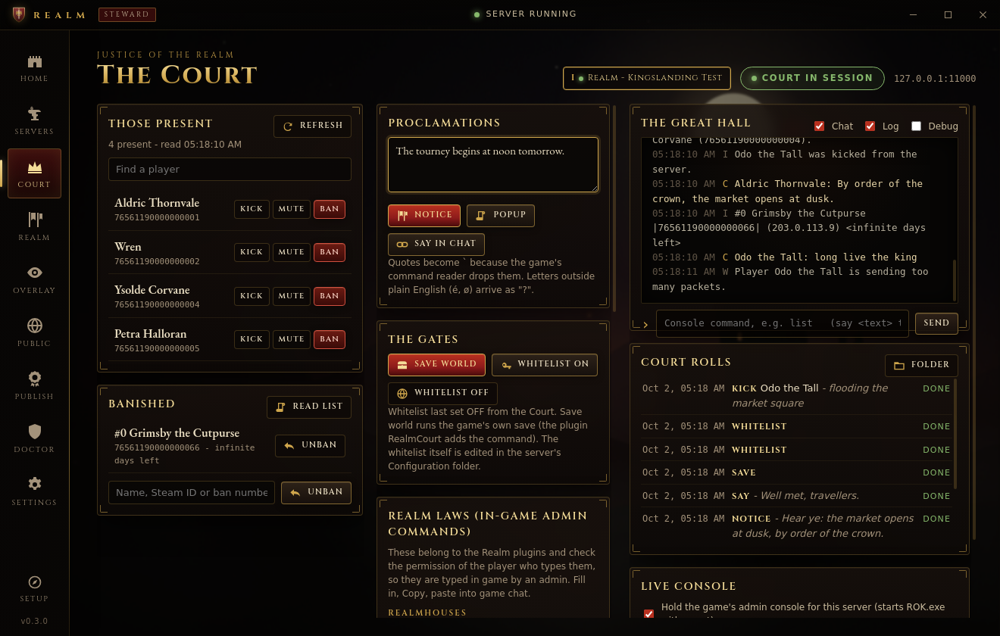

# The live admin console and the Court

Realm Steward now talks to each `ROK.exe` it runs through the game's own admin console socket. That gives two-way control: commands go in and the game's answers, log lines, warnings, errors and player chat come back live. The **Court** screen builds moderation on top of it.

Tags: **[DEC]** read from the decompiled `Assembly-CSharp.dll` / `Oxide.ReignOfKings.dll` of Oxide.ReignOfKings 2.0.3867 (zip sha256 `6c35c623…c6c8`). **UNVERIFIED** means it has not been seen on a real server yet.

## Why this was needed

- **The game does not read standard input.** No `Console.ReadLine`, `Console.In` or `OpenStandardInput` appears in `Assembly-CSharp` [DEC]. Oxide's own console (`Oxide.Core.ServerConsole.ConsoleInput`) reads keys with `Console.ReadKey` from a console window it allocates itself, not from a pipe [DEC]. So the commands Steward used to write to `ROK.exe`'s stdin, including `quit` for **Stop**, were most likely ignored: Stop then only worked through **Force stop** after a minute. UNVERIFIED on a real server, but nothing in the code reads that pipe.
- **Errors were hard to see.** The console sends every warning, error and exception (with its stack) the moment it happens, tagged `[W]`, `[E]`, `[X]`.

## How it works for the owner

1. **Settings → Server program: ROK.exe** (the owner's setup already uses it, because `Server.exe` needs administrator rights).
2. Start the server. Steward starts `ROK.exe … -cport 11000` (Server I; II to IV use 11001 to 11003) and connects to `127.0.0.1:<port>` straight away. The Servers console shows `Admin console connected (127.0.0.1:11000)`.
3. Commands typed in the Servers console now go to the game, and its answer appears under them. Type them with or without the `/` (`list` becomes `/list`). `say <text>` speaks in chat as the server.
   Everything else the game logs also streams in as it happens: `[W]` warnings, `[E]` errors and `[X]` exceptions (shown in red), joins, leaves and chat. This is the only live view of the game's own messages, which otherwise go only to `<server>\Logs\Log[...].txt`. The Court's 20-second roster refresh is kept out of it.
4. The **Court** screen lists the people present, and has kick, ban, mute, unban, notices, popups, chat, whitelist and world save. Every action is written to the **Court rolls**.
5. **Stop** sends `/shutdown` over the console: the game saves and exits on its own.
6. To turn it off for one server, untick **Live console** at the bottom of the Court screen. That takes effect at the next start, and Steward then falls back to stdin as before.

The Court can be used only while the server runs with the live console. With `Server.exe` it explains why it cannot be used.

## Protocol [DEC]

Sources: `CodeHatch.Engine.Sockets.Packet`, `PacketType`, `SocketServer`, `SocketClient`, `CodeHatch.Engine.Administration.SocketAdminConsole`.

| Field | Type | Meaning |
|---|---|---|
| size | int32 LE | body length + 14: the whole frame, including this field |
| id | int32 LE | request id; a Response carries the id of the request |
| type | int32 LE | 0 Authentication, 1 Message, 2 Response (spelled `Reponse` in the code), 3 Disconnect |
| body | bytes | `Encoding.ASCII`: every character above 0x7F becomes `?` |
| trailer | 2 bytes | `00 00`; anything else makes the reader throw `FormatException` |

- **Splitting.** A message is cut into packets with at most 4082 body bytes, so a full frame is 4096 bytes. The reader keeps reading while `size == 4096`. A message whose length is an exact multiple of 4082 therefore ends with an extra empty packet (`Packet.GetPackets`, `ReadPackets`). Steward's encoder does the same, and the tests compare it byte for byte with an implementation written independently from the C#.
- **Requests.** Every packet group whose type is **not** Response is joined and passed to `Console.Submit` on the main thread (`OnMessageReceived` → `DifferAction`). No authentication exists: an Authentication packet would be run as a command too, so Steward never sends one.
- **Commands need `/`.** In `Console.Submit`, text that starts with `/` becomes a `PlayerCommandEvent`. Any other text is **chat** from the server (`PlayerChatEvent`).
- **Answers.** After the command runs, the game sends a Response with the request's id. Its body holds only text raised through `ConsoleAddMessageEvent`, which is almost always empty. Command output (`player.SendMessage` on the server player → `Console.AddMessage` → `Logger.Info`) instead reaches every console client as `[I] …` Messages, one per line, sent **before** that Response on the same connection. Steward therefore sends one command at a time and takes the Messages received between the send and the Response as its output. An unrelated line logged in the same frame can slip in.
- **Server to client.** Every second the game broadcasts an empty Message as a keep-alive (`PingClients`). Log lines are prefixed `[D] [I] [W] [E] [X]`; `[X]` lines carry the exception type, the message and the stack. Player chat arrives as `[C]`.
- **Disconnect packet.** It is sent only from `OnProgramExit` when `RestartAfterShutdown` is false: after `/shutdown`, `/logout` or `/quit` from the server, and on the very first run. A server that closes without one (crash, daily `restartTime`, `/restart`) "wants a restart" in the game's own terms. The Steward supervisor logic is unchanged and still decides on restarts.
- **Duplicate suppression.** The game's logger drops a line it has already logged 50 times within 5 minutes (`Logger.Log`, `LoggerTypeSettings.MaxDuplicateLogs = 50`, tracker cleared every 300 s). The Court therefore polls the player list no more often than every 20 s, which is 15 polls in 5 minutes. The RealmCourt roster puts a sequence number in each line so that no two lines are ever identical.

## Life cycle and the design decision

What the game does [DEC]:

1. `SocketAdminConsole.OnEnable` runs whenever the game is a dedicated server (`-batchmode` without `-ip`). It binds **0.0.0.0** on `-cport`, or on **11000** when `-cport` is not given, and logs `Admin console enabled.`.
2. **With `-cport` only:** 10 s after the console starts, if no client is connected, the game calls `Server.Shutdown()`.
3. **With or without `-cport`:** when the **last** client disconnects, it calls `Server.Shutdown()`. `CoreServer.Shutdown` disconnects every player and calls `Game.Save()`, so this is a **clean, saved stop**.
4. A client that closes its socket is noticed late: the game's receive thread gets `EndOfStreamException`, which is not a `SocketException`, so it only logs it. The disconnect is detected on the next keep-alive write (`IOException` → `Disconnected`), about 1 to 2 s later.
5. A bind failure (port already taken) is caught and logged, and the game runs without a console.

Options considered:

| Option | Verdict |
|---|---|
| No `-cport`, connect to 11000 | **Rejected.** All instances try to bind 11000, so with two servers Steward could control the wrong one. Disconnecting would still shut that server down. |
| No `-cport`, never connect (old behaviour) | Safe, but Stop and commands depend on stdin, which the game does not read. The console port sits open on 0.0.0.0:11000, where any client that connected and then disconnected would shut the server down. |
| **`-cport 11000 + slot − 1`, Steward connects at spawn and holds the connection** | **Chosen.** One port per server, in the range that `lib/fleet.js` already keeps free and that Go Public blocks inbound. While Steward holds the connection, a stranger's connect and disconnect no longer stops the server, because Steward is still connected. |

Safety rules in `lib/court-host.js`:

- **Connect at spawn and keep retrying** every 250 ms until the console listens. The 10 s window only starts when the console starts, so the attempts that fail while Unity is still loading do no harm. There is no give-up timer while the process runs.
- **Never close the connection by accident.** Protocol errors, a stale link (no keep-alive for 5 s, for example during a long save) and command time-outs are all reported, and the socket stays open. Closing it is reserved for a stop.
- **Stop:** `/shutdown` first. If the game is still running 25 s later, Steward closes the console, which triggers the same save and shutdown. After 60 s **Force stop** is offered, as before. The stop is marked as requested first, so the supervisor never counts it as a crash.
- **If Steward dies, its servers save and stop** instead of running on unsupervised. Steward's own close button already stopped the servers before closing.
- **Never reached:** if the console was never reached and the game exited within 2 minutes, `-cport` is switched off for that server for the rest of the session and the log says so. Any following automatic restart then runs without `-cport`.
- **Port taken:** if the server's console port is already in use, Steward starts without `-cport` and logs why.
- **`Server.exe` never gets `-cport`.** Commands still go to its stdin. UNVERIFIED: whether `Server.exe` uses this socket itself (its name is in `SocketAdminConsole.EditorConsolePath`).
- **Loopback only.** The client refuses any host other than 127.0.0.1. The game still binds 0.0.0.0, so keep the Go Public rule that blocks TCP 11000 to 11003 inbound.

## Commands the Court uses [DEC]

All of these are run as the server player, which passes every permission check (`PlayerExtensions.HasPermission`: `IsServer` → true). They work only while `enableCommands` is True in `ServerSettings.cfg`, which is the default (`CommandManager.ExecuteCommand`).

| Court control | Console line | Source and notes |
|---|---|---|
| Those present | `/list` (aliases `online`, `players`) | `ThronesCommandHandler.list`: `Online Players(N):` then `A, B, C`, or `There are no players online.` |
| … with Steam IDs | `/realm.players` | `plugins/RealmCourt.cs` (below) |
| Kick | `/kick "<name>" "<reason>"` | `CoreCommandHandler.Kick`. The game joins the reason words **without spaces**, so Steward quotes the reason as one argument. The player is matched with `MatchFirstPlayerByName`; UNVERIFIED whether an exact name wins over a prefix match. |
| Ban | `/ban "<name>" [days] <reason>` | `CoreCommandHandler.Ban`. Days 0 or none = forever. A forever ban whose reason starts with a number gets `Reason:` in front, because the game would read that number as the days. Offline players are found in the user registry. |
| Unban | `/unban <name, ban number or Steam ID>` | `CoreCommandHandler.Unban` |
| Ban list | `/banlist` | `#i Name \|id\| (ip) <N days left>` |
| Mute | `/mute "<name>" [days]` | `CoreCommandHandler.Mute` |
| Notice | `/notice <text>` | `Server.Notice`: on-screen text for everyone |
| Popup | `/popup <text>` (alias `alert`) | `ThronesCommandHandler` |
| Say in chat | `<text>` without `/` | `Console.Submit` → chat as the server |
| Whitelist on / off | `/whitelist enable` / `/whitelist disable` | `CoreCommandHandler` subcommands. The current state cannot be read back from the console, so the Court shows the last state it set. |
| Save world | `/realm.save` | The game has **no** save command. `plugins/RealmCourt.cs` adds this one and calls `Game.Save()`. |
| Stop (Servers screen) | `/shutdown` | `CoreCommandHandler.Shutdown`: saves, stops, and sends the Disconnect packet |

**Arguments** follow the game's parser (`CommandInfo.Args`): words split on spaces; `"…"` or `'…'` group words, but the grouped text may not contain a quote; `\ ` is an escaped space. A name with an apostrophe cannot be passed intact, because the game turns `\'` into ` Q`, so the Court refuses such a name and suggests the Steam ID or ban number instead. In free text such as reasons and notices, quotes become a backtick (`` ` ``).

### The RealmCourt plugin

`plugins/RealmCourt.cs` is deployed with the other plugins by **Update plugins**. It writes two entries straight into the game's own command table (`CommandManager.RegisteredCommands`) with the permission `realm.court`: `/realm.save` and `/realm.players`. The server player always has that permission, and no player has it unless an admin grants it. Each method also checks `cmd.Player.IsServer`. Its output goes to the server console only. It compiles at C# 3 against the 2.0.3867 metadata (`tools/plugin-compile-check/check.sh`). UNVERIFIED at run time.

### Realm plugin admin commands

`/house sync|disband|pardon|unlink`, `/claim cancel <house>`, `/council`, `/contract admin cancel|refund|pay <id>` are Oxide **chat** commands. They check an Oxide permission (`realmhouses.admin`, `crownandconsequences.admin`, `realmcontracts.admin`) on the player who types them. From the console Oxide runs a chat command only when it finds the sender as a Covalence player (`ReignOfKingsCore.IOnServerCommand`), and the server is not one. The Court therefore lists them under **Realm laws** with fields and a **Copy** button for an admin to paste in game. A console bridge for them would have to be added to those plugins.

## Files

| File | What |
|---|---|
| `launcher/lib/admin-console.js` | Protocol: encoder, splitting, incremental decoder, quoting, and a client with retry, keep-alive watch, one-at-a-time commands and deliberate close |
| `launcher/lib/moderation.js` | Command builders, output parsers, the plugin command list, the Court rolls (`<profile>\court\court-log.jsonl`, rotated at 2 MB) and the per-server on/off switch (`<profile>\court\console.json`) |
| `launcher/lib/court-host.js` | Main-process glue: `-cport`, connect at spawn, command routing, stop ladder, never-reached switch, IPC `court:*` |
| `launcher/renderer/court.js`, `court.css` | The Court screen |
| `plugins/RealmCourt.cs` | `/realm.save`, `/realm.players` |
| `launcher/test/admin-console.test.js`, `moderation.test.js`, `court-host.test.js`, `fake-admin-console.js` | Unit tests and the imitation game console |
| `launcher/scripts/court-screens.mjs` | Electron walk-through under xvfb; screenshots `docs/img/court-*.png` |

`<profile>` is `%APPDATA%\Realm`.

## Checking it on the real server (Windows)

1. Start Server I from Steward. In `G:\RealmTest\server\Logs\realm-server.log` look for `Admin console enabled.` and then `Admin console connected.`
2. `netstat -ano | findstr :11000` shows a LISTENING line (0.0.0.0) and one ESTABLISHED pair on 127.0.0.1.
3. Type `list` in the Servers console. The answer should appear under `> /list`.
4. Court → **Save world**. The log should show `Saving game...`. If the Court says the plugin is not loaded, run **Update plugins** first.
5. **Stop**. The log should show `has shut down the server`, and the process should exit within seconds without Force stop.
6. While the server runs, close Steward with its window's close button (that stops the servers), or end `Realm Steward.exe` in Task Manager. The server should save and stop by itself within a few seconds.

Still UNVERIFIED at run time: steps 1 to 6 themselves; whether the scene's `SocketAdminConsole` is enabled on the dedicated server (when it is not, nothing listens, nothing shuts down, and Steward simply keeps trying while the Court says it is opening); the exact text of kick and ban confirmations; and how a player name with characters outside ASCII matches, since they arrive as `?`.

## Tests run

- `npm test` in `launcher/`: framing, splitting at 4081/4082/4083/8164 bytes, byte-by-byte and random partial reads, frames the game could not send, the 10 s rule, shutdown on the last disconnect, reconnect, command time-out, stale link, protocol error with the socket kept open, every Court builder checked against a port of the game's argument parser, log rotation, and court-host routing (`-cport`, stop through `/shutdown`, the close-to-stop fallback, the never-reached switch, a busy port).
- `xvfb-run -a node scripts/court-screens.mjs`: a real Electron Steward starts an imitation `ROK.exe` whose console speaks this protocol, and the script uses every Court control (19 checks).
