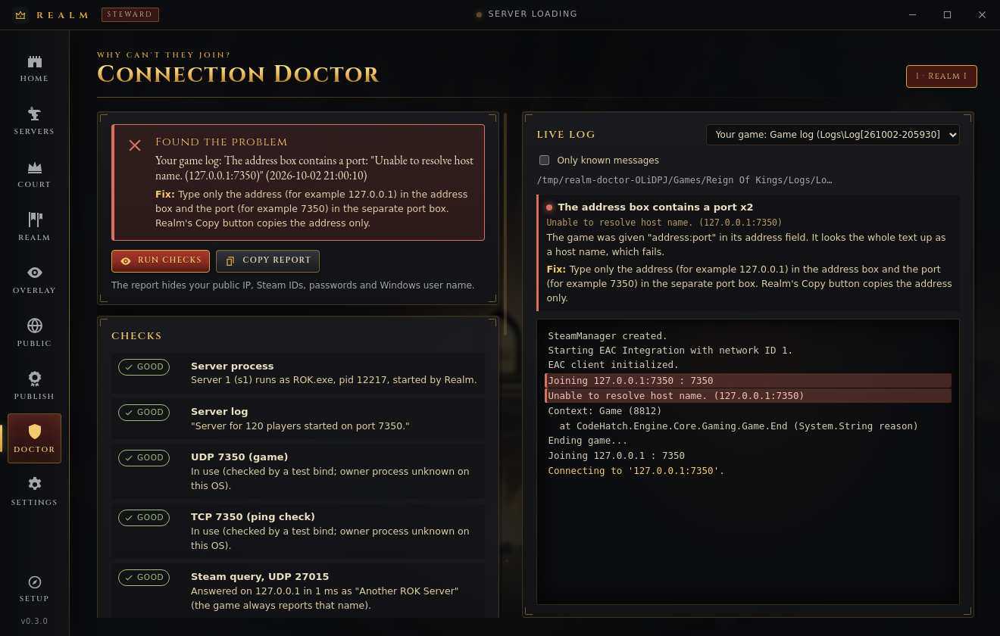
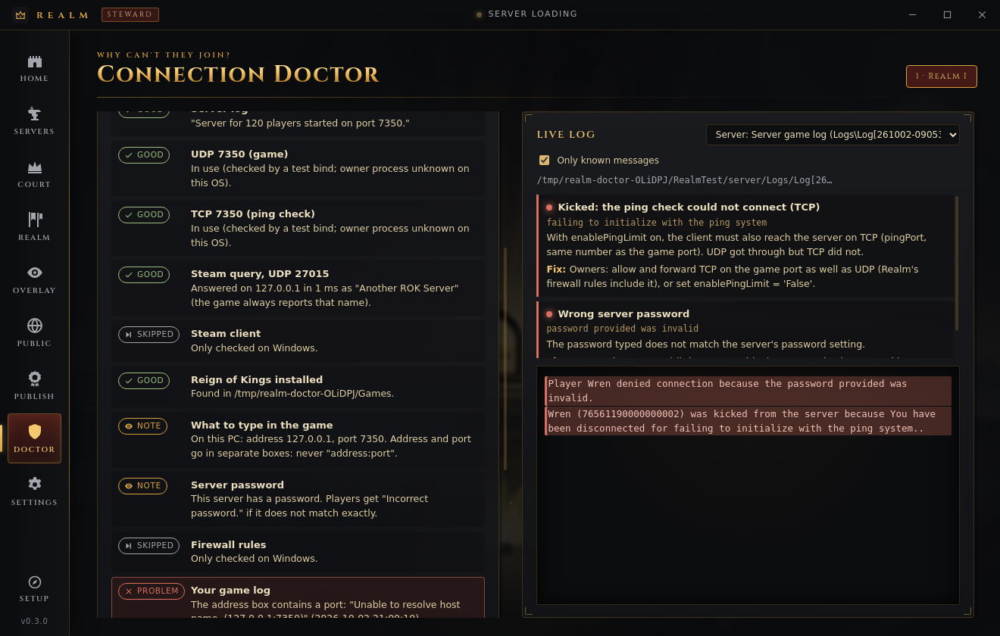
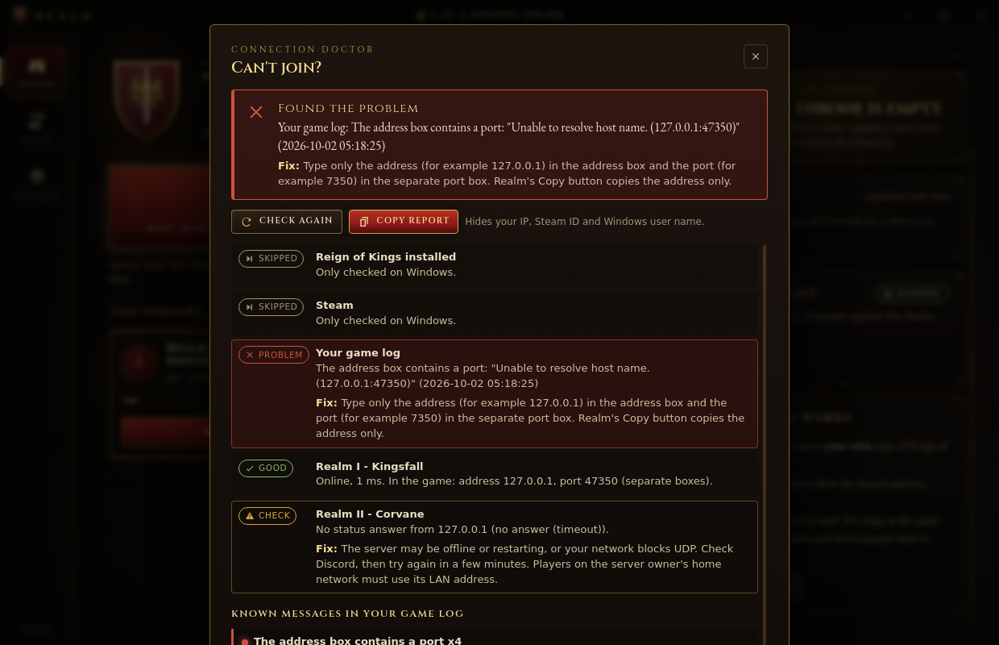

# Connection Doctor: why a join fails, in plain English

Both Realm apps have a Connection Doctor:

- **Realm Steward** has a **Doctor** entry in the sidebar. Pick a server, and it checks that server step by step. It also shows the live game log or server log with known problems highlighted, explains a pasted game popup, and has **Copy report**.
- **Realm** (the player app) has a **Can't join?** button under "How joining works". It runs the player-side checks and has the same paste box and **Copy report**.

The Doctor only reads. It never changes the firewall, the router, a config file or a game file.

## Why errors seemed not to be logged

Evidence tags are the same as in [join-and-scale.md](join-and-scale.md).

- **The game writes its own messages to `Logs\Log[yyMMdd-hhmmss].txt`, not to Unity's log.** [DEC] In `Logger`, `LogToFile` defaults to `true`, and `LogWithStacktrace` writes to that file *instead of* `Debug.Log`. So `ROK.exe -logFile <server>\Logs\realm-server.log` gets only Unity's own lines. The server's real messages (start-up, "denied connection because…", kicks, Steam errors) are in `<server>\Logs\Log[…].txt`. The path is relative to the working directory. The file name uses a 12-hour clock (`hh`), and each line looks like `[260930-201502] [Error]  <message>`. The Doctor reads both files.
- **The game client keeps the same kind of log** in `<game install>\Logs\Log[…].txt`. **UNVERIFIED:** that Steam and EAC start the game with the install folder as its working directory. That is Steam's normal behaviour. The client's Unity log is `<game install>\ROK_Data\output_log.txt` [SEC] (the Unity 5.x location). Steamworks errors such as `SteamAPI_Init() failed` are written there.
- **Most refusals are never logged on the client.** [DEC] `CoreServer.OnConnectionLost` → `GetConnectionError` → `ShowPopup`, and nothing in that path writes to a log. The server *does* log the matching line, for example `Player X denied connection because the password provided was invalid.` For the player side, paste the popup text into the Doctor.

## What the classifier knows (exact strings from the DLL)

| Message (as the game writes or shows it) | Where | Plain cause → fix |
|---|---|---|
| `Unable to resolve host name. (127.0.0.1:7350)` / `Joining 127.0.0.1:7350 : 7350` | client log [DEC Game.Join] | "address:port" was typed in the address box → type only the address, and put the port in its own box |
| `Unable to resolve host name. (<name>)` | client log | typo or unknown DNS name → copy the address again |
| `Invalid port value…`, `Unable to connect to '<ip>'.` | client log | bad port / socket error |
| `Connection timed out.`, `Took too long to connect to server.` | popup | server down, wrong port, or a firewall or router drops UDP → run the steward checks; join 127.0.0.1 from the server PC and the LAN address from the same network |
| `Please run the game from Reign Of Kings.exe` | popup | started ROK.exe directly → start it from Steam |
| `EAC has not intiailized yet. Please try again.` (the typo is the game's) | popup | joined before EAC was ready → wait at the menu, join again |
| `You need to be logged into steam…`, `SteamAPI_Init() failed`, `Could not authenticate steam.` | client log / popup | Steam is not running or not signed in |
| `The server is not running the same version as you.` / `…denied connection due to wrong version.` | popup / server log | the builds differ → update both in Steam and make a fresh test copy |
| `Server is full.`, `Waiting in queue... Position n/m.` | popup / loading screen | full, or the join queue (`timeBetweenPlayerJoin`, default 10 s) |
| `You are banned…`, `You are not on the server whitelist.`, `Incorrect password.` (+ the server's `denied connection because…` lines) | popup / server log | ban, whitelist, password |
| `You have been disconnected for failing to initialize with the ping system.` / `…No players are connected to the ping system on port N.` | popup / server log | TCP pingPort is not reachable while `enablePingLimit` is on → allow and forward TCP as well as UDP, or turn the limit off |
| `…exceeding the ping limit.`, `…unreliable connection to the ping system.` | popup | ping kicks |
| `This is the first time you have run this server.` | server log | a new folder exits on purpose → start it again |
| `TypeInitializationException` … `CodeHatch.Networking.Events.EventManager` | server log | the server copy lacks a DLL that `Assembly-CSharp.dll` references → see the **Server game files** check below |
| `The port N is already being used by another application.` | server log | port clash |
| `Port already in use. Make sure you have allowed port N…`, `The Steam game server could not initialize.` | server log | steamAuthPort clash, or Steam is down; the server runs without Steam auth |
| `Server for N players started on port P.`, `Steam game server started. (IP: …)` | server log | good news: ready, and the public IP |
| `Attempting join game: <ip>:<port>…` | client log | proves quick-join arguments reached the game (the open EAC question in join-and-scale §1.5) |

If a later `Connecting to '<ip>:<port>'.` line follows an error, that error was fixed in between. The Doctor then says the join got that far, and that any refusal after it appears only as a popup.

## The steward checks

0. **Server game files.** Every assembly that the server's `<Data>\Managed\Assembly-CSharp.dll` references is a DLL in that `Managed` folder. Steward reads the DLL's .NET metadata itself (the AssemblyRef table, `launcher/lib/clrmeta.js`; nothing is loaded or run) and lists the folder. Framework assemblies (`mscorlib`, `System`, `System.*`, `Mono.*`) are not checked, because Unity's Mono may provide them from elsewhere. Any other missing reference that the Steam copy has is a **Problem** (when the Steam copy lacks it too, or cannot be read, it is only a warning: the build may not ship that file, and nothing needs doing if the server starts): the server stops at start-up with `TypeInitializationException` for `CodeHatch.Networking.Events.EventManager`, whose static constructor walks Assembly-CSharp's exported types and fails when a referenced assembly cannot be loaded (a real owner's server, 2026-10). The fix names the files: copy **only those** DLLs from the Steam copy of the dedicated server (`ROK_Data\Managed`), never over the Oxide-patched `Assembly-CSharp.dll`; when a file is missing from the Steam copy too, run **Verify integrity of game files** on Reign of Kings Dedicated Server in Steam first. The check says which files the Steam copy has. It comes first, so a missing file is the verdict even while the server is stopped. **UNVERIFIED:** which assemblies a real server keeps in `ROK_Data\Managed` (the reference list was read from the Oxide-patched DLL; the rule is conservative for that reason).
1. The server process: which instance and pid, or a server from that folder running outside Realm.
2. The server log shows `Server for N players started on port P.`, or the blocker: first run, a port clash, a version problem, missing game files.
3. UDP game port and TCP ping port are listening. This uses `Get-NetUDPEndpoint` and `Get-NetTCPConnection` (read-only) and shows the owning process. On a public server it also checks for a socket bound only to 127.0.0.1.
4. A2S answers on `127.0.0.1:<steamAuthPort>`.
5. Steam is running and signed in. [SEC] This reads `HKCU\Software\Valve\Steam\ActiveProcess` (`pid`, `ActiveUser`). **UNVERIFIED** in Steam's offline mode.
6. The game is installed (app manifest).
7. What to type, per place: this PC, the same network, the internet. Address and port always go in separate boxes.
8. Windows Firewall rules are present (read-only list).
9. The admin console (TCP 11000–11003) is open without the Realm block rule on a public server.
10. Public reachability when Go Public is on: CGNAT, a double router, and TCP through the public IP.
11. The newest problem in this PC's game log.

The player app runs steps 5 and 6, the game-log step, and an A2S query to each listed server.

## Copy report

The report is plain text: the verdict, every step with its fix, the known messages found, and the last 60 lines of the chosen log. Before it reaches the clipboard, `redact()` replaces:

- public IPv4 addresses (LAN and loopback stay);
- SteamID64 values;
- the Steam **auth ticket** that the client logs in `[Login Data] … Auth:` ([DEC] `ConnectionLoginData.ToString`);
- `-pass`, `password` and `rConPassword` values;
- the user name in `C:\Users\<name>`.

## Tests

- `npm test`: `test/gamelog.test.js` checks the classifier against the real strings, log parsing, log locations, live-tail reads and redaction. `test/doctor.test.js` runs both check runners with fake facts. `test/gamefiles.test.js` checks the metadata reader on synthetic assemblies it builds (and on the real Oxide-patched `Assembly-CSharp.dll` when `~/.cache/realm-compile-check` has it; otherwise that one test is skipped with a message), damaged and truncated files, the game-files check on temporary server folders, its Doctor step and the `EventManager` log rule.
- `xvfb-run -a node scripts/doctor-screens.mjs`: both apps against an imitation server and an imitation game install (20 checks), and it saves the screenshots above. This run does not exercise PowerShell, the registry or Windows Firewall. Those paths are **UNVERIFIED** until they are run on the owner's PC.
