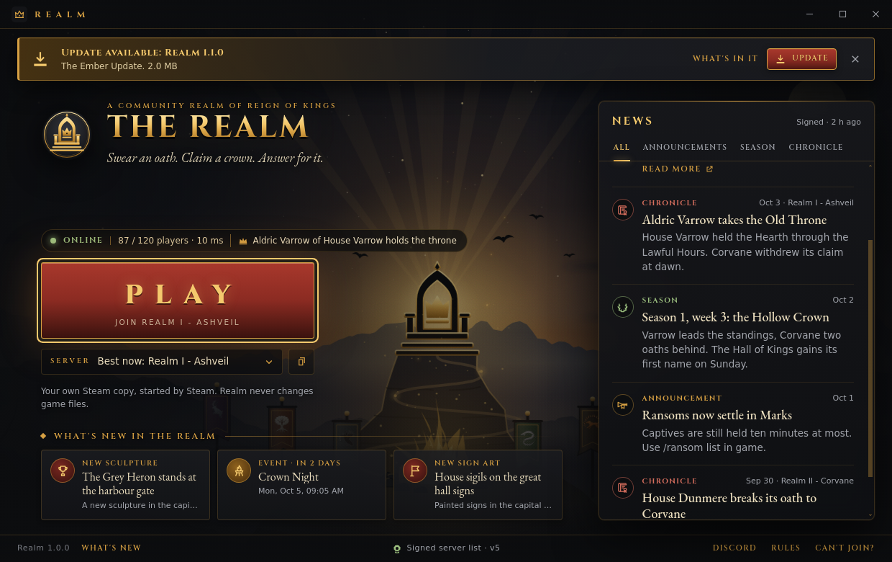
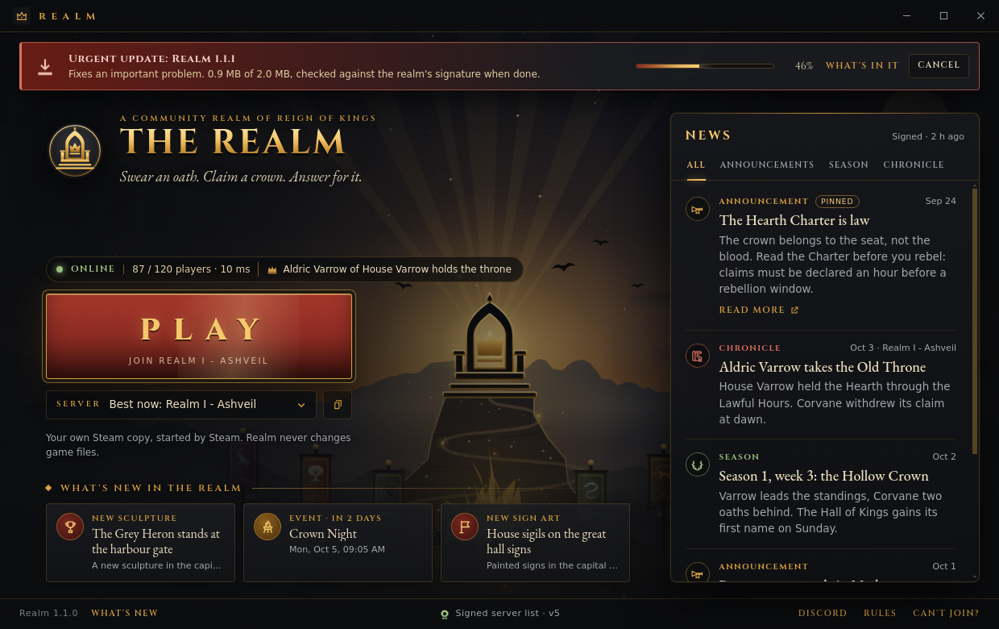
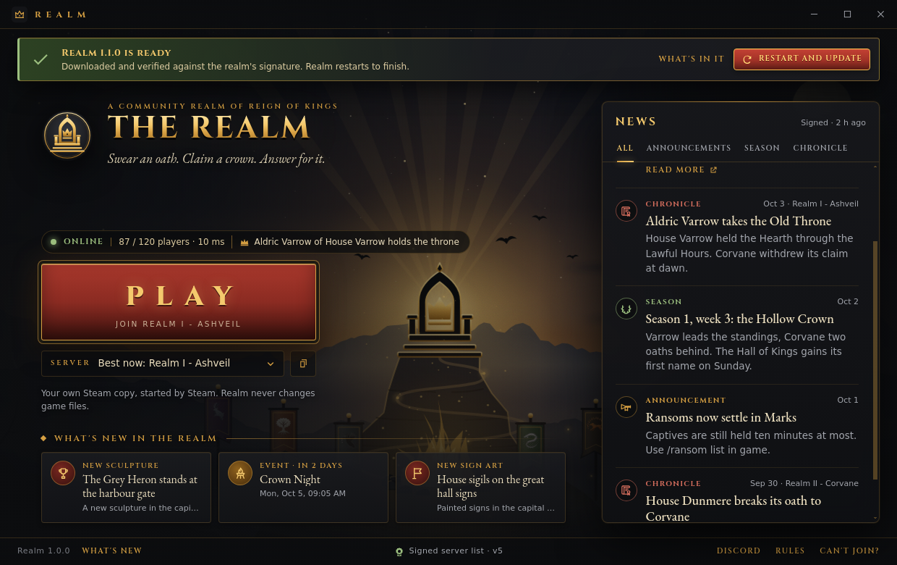
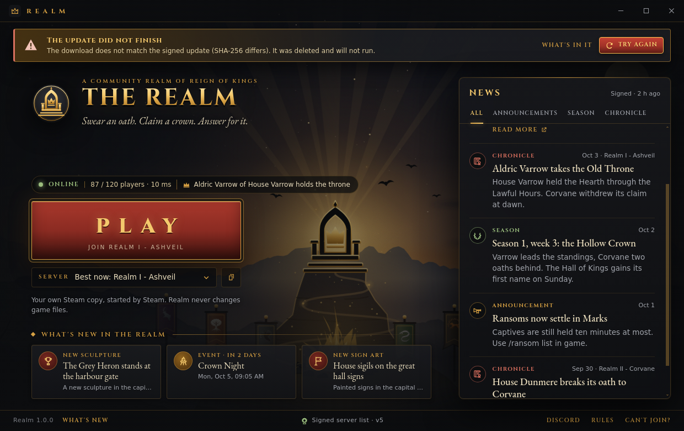
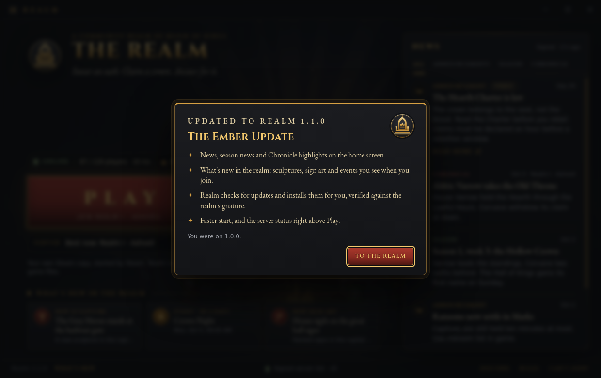
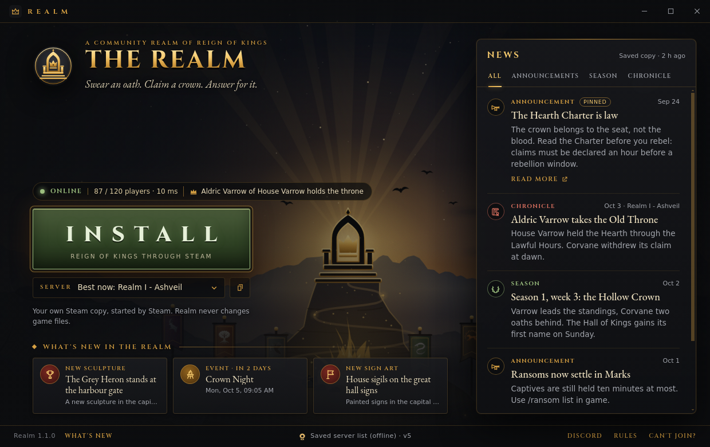
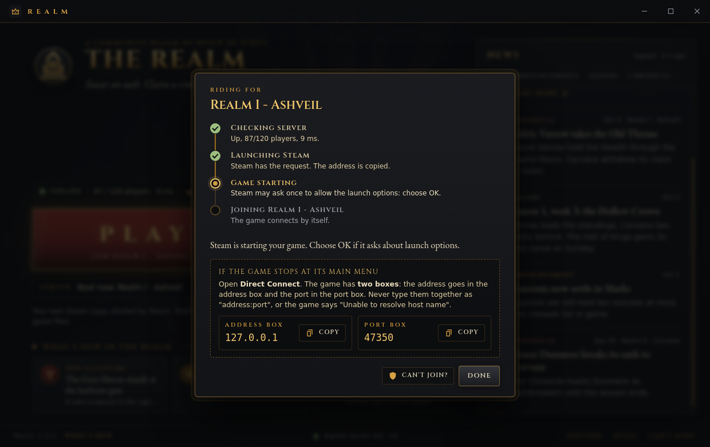
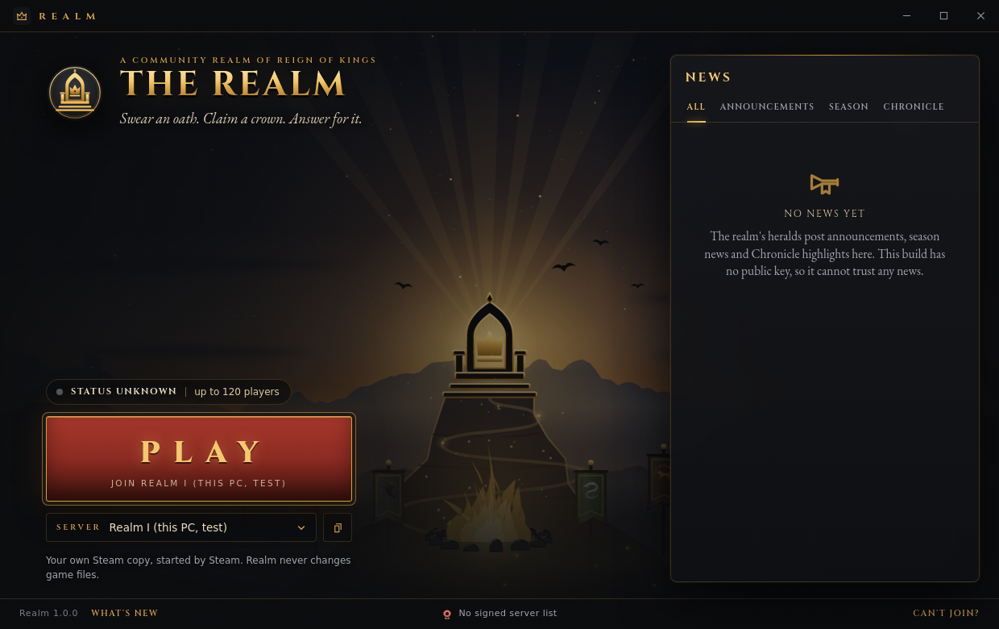

# Realm, the player launcher

Realm (`Realm-Setup-<version>.exe`) is the app players install. It is one screen: the realm's key art and name, a big Play button, the server status, the news, and what is new in the realm. It has no owner features. Realm Steward (the owner app) is a separate build.

Code: `launcher/player/` (main process and bridge), `launcher/renderer/player.*` (the screen), `launcher/lib/news.js` (signed news), `launcher/lib/updater.js` (signed updates). Build config: `launcher/build/player.json`.


## What the player sees

| Part | What it does |
|---|---|
| Key art and brand | The Old Throne key art (`art/keyart`), the Realm emblem, the realm name and tagline from the build. |
| Status line | Online, Full or Offline for the server Play will join, players (`87 / 120 players`; `~` when only Steam's count is known), ping, and who holds the Old Throne when the server shares its Chronicle. |
| Play | Opens Reign of Kings through the player's own Steam and joins (`steam://run/344760//-ip <host> -port <port>/`). The address is copied too, and a small always-on-top card shows where to paste it if the game stops at its menu. |
| Install | Replaces Play when Reign of Kings is not installed: `steam://install/344760`. When Steam itself is missing it opens the Steam website. Realm looks again when its window gets focus, so Play comes back after Steam installs the game. |
| Server picker | "Best now" (the server with room and the best ping, `lib/shared/pick.js`) or one server from the signed list. Hidden when the list has one server. The copy button copies the address only (the port has its own box in the game). |
| News | Announcements, season news and Chronicle highlights from the signed news feed, with tabs. Pinned items first, then newest first. |
| What's new in the realm | Up to three server-side changes from the news feed: new sculptures, new sign art, events, atmosphere, rules. These arrive by themselves when players join, so the app only tells players about them. |
| Update banner | Shown when a newer Realm is offered by the signed update manifest. See [Updates](#updates). |
| Footer | Version and "What's new" (patch notes), whether the server list is signed, Discord, Rules, and "Can't join?" (the Connection Doctor, read-only checks). |

`realm://join/<server id>` links still work: they always ask before joining, and only ids in the signed list are accepted.

| | |
|---|---|
|  |  |
|  |  |
|  |  |
|  |  |

## What was removed

The player app used to have a rail with Guide and Settings, a first-run intro with a house picker, a tray icon and Chronicle notifications. All of it is gone: the player sees one screen. The join method comes from the build (`joinMethod` in `player-config.json`, quick join by default). Old preference files still load; unknown keys are ignored.

The player app has no server, setup, fleet, firewall, publish or settings call. `launcher/test/player-edition.test.js` checks:

- the require graph of `player/main.js` and `player/preload.js` reaches only `player/`, `lib/shared/`, `lib/news.js` and `lib/updater.js`; never `lib/publish.js`, `lib/realm.js`, `lib/server-process.js` and the other Steward modules;
- the bridge exposes exactly the player calls, and every call stays on `app:` and `player:` channels;
- `build/player.json` packs only player files: `player/*`, `lib/shared/**`, `lib/news.js`, `lib/updater.js`, the player, coach and Doctor pages, fonts, the logo, key art and icon sprite;
- the page has no rail, settings, intro, tray or notification code;
- the only file Realm ever runs is the update installer, and only after it is hashed again.

## News (`news.json`)

The owner publishes a signed `news.json` next to `servers.json`. Same envelope and same owner key as the server list:

```json
{ "format": "realm-news/1", "alg": "Ed25519", "keyId": "<16 hex>",
  "payload": "<base64 of the exact JSON bytes>", "signature": "<base64>" }
```

The payload:

```json
{
  "schema": 1, "kind": "realm-news", "realm": "The Realm", "seq": 12,
  "issued": "2026-10-03T10:00:00Z", "expires": "2027-01-01T10:00:00Z",
  "items": [
    { "id": "charter", "type": "announcement", "pinned": true, "title": "The Hearth Charter is law",
      "body": "Read the Charter before you rebel.", "date": "2026-09-24T18:00:00Z", "link": "https://example.org/rules" },
    { "id": "crowned", "type": "chronicle", "title": "Aldric Varrow takes the Old Throne", "date": "2026-10-03T08:00:00Z", "server": "s1" },
    { "id": "week-3", "type": "season", "title": "Season 1, week 3", "date": "2026-10-02T18:00:00Z" },
    { "id": "heron", "type": "realm", "tag": "sculpture", "title": "The Grey Heron stands at the harbour gate", "date": "2026-10-01T09:00:00Z" },
    { "id": "crown-night", "type": "realm", "tag": "event", "title": "Crown Night", "date": "2026-10-02T09:00:00Z", "at": "2026-10-04T20:00:00Z" }
  ]
}
```

| Field | Rule |
|---|---|
| `kind` | Must be `realm-news`. The signature covers only the payload, so the payload says what it is: a signed server list or update manifest relabelled as news is refused. |
| `type` | `announcement`, `season`, `chronicle` (a highlight the owner writes up) or `realm` (a content change). |
| `tag` | Only for `realm`: `sculpture`, `sign`, `event`, `atmosphere`, `rules` or `other` (the default). |
| `id` | 1 to 40 lower-case letters, digits or `-`; unique. |
| `title`, `body` | One line up to 100 characters; body up to 600 and may have line breaks. Shown as plain text. |
| `date` | When it was posted. An item dated in the future stays hidden until then, so news can be scheduled. |
| `at` | Optional start time for events. "What's new in the realm" shows "in 2 days" and drops the event 6 hours after it starts. |
| `link` | Optional https address. "Read more" opens only a link that is in the signed feed. |
| `server` | Optional server id; shown when the list has more than one server. |
| `seq` | Must not go down. A feed with a lower `seq` than one this PC has accepted is refused (no rollback). |
| size | At most 60 items and 128 KB. |

How Realm loads it, on start and every 30 minutes: download, then the saved copy, then a copy inside the build (`bundledNews` in `player-config.json`, optional). A download that is unsigned, signed with another key, changed, too old or expired is refused and the saved copy stays on screen. The saved copy is shown even after it expires, marked "Saved copy". A build without a public key trusts no news.

The address is `newsUrl` in `player-config.json`, or `news.json` next to `manifestUrl` when that is not set. https only (development runs may use http to 127.0.0.1).

**Publishing.** `lib/news.js` has `buildNews` and `signNews`, the same shape as `lib/publish.js` for servers.json. A "Publish news" form in Realm Steward is a follow-up. Until then nothing in the apps signs a news feed, because the owner's key stays encrypted in the Steward profile.

## Updates

The owner publishes a signed `update.json` next to `servers.json` (or at `updateUrl` in `player-config.json`). Envelope format `realm-update/1`, same owner key. Payload:

```json
{
  "schema": 1, "kind": "realm-update", "app": "realm-player", "seq": 4,
  "issued": "2026-10-03T10:00:00Z", "expires": "2026-12-02T10:00:00Z",
  "version": "1.1.0", "released": "2026-10-03T10:00:00Z", "hotfix": false, "minVersion": "1.0.2",
  "file": { "name": "Realm-Setup-1.1.0.exe", "url": "https://example.org/Realm-Setup-1.1.0.exe",
            "size": 81234567, "sha256": "<64 hex>" },
  "notes": { "title": "The Ember Update", "items": ["One line per change."] }
}
```

What Realm does, from `lib/updater.js` and `player/main.js`:

1. **Check** 3 seconds after start and every 4 hours. The manifest must be signed with the key in the build, not expired, not older (`seq`) than one already accepted, and its `version` newer than the running one (semantic-version order: `1.0.0-beta.2 < 1.0.0 < 1.0.1 < 1.10.0`). Anything else offers nothing. A failed check keeps an update that was already offered.
2. **Banner.** "Update available: Realm 1.1.0" with the notes title and size, "What's in it" (the signed notes), Update, and Later (until Realm starts again).
3. **Hotfix.** `hotfix: true`, or a `minVersion` above the running version, makes it urgent: a red banner without Later, and the download starts by itself. It still runs only when the player presses the button.
4. **Download** to `%APPDATA%\Realm Player\updates\Realm-Setup-<version>.exe.partial`, streamed and hashed on the way. The download stops as soon as it is larger than the signed `size`. When it ends, the size and SHA-256 must equal the signed values; otherwise the file is deleted and the banner says why. Only then is it renamed to `.exe`. Older installers are removed. Cancel stops it and leaves nothing behind.
5. **Run.** "Restart and update" hashes the file again (a file changed on disk since the download is deleted, never run), hands it to Windows with `shell.openPath`, and quits. The installer (electron-builder NSIS, `runAfterFinish`) starts the new Realm when it finishes. The portable build cannot replace itself: it shows the verified installer in its folder instead.
6. **What's new.** The first start of a newer version opens the patch notes once: the notes from the signed manifest that offered the update (kept in the profile), else `player/release-notes.json` from the build. A first install shows nothing. The footer link "What's new" opens the notes for the running version at any time.

Realm never runs a file that is unsigned, signed with another key, or whose size or hash differs. It never starts any other program: the only `shell.openPath` call is the verified installer, and the player app has no `child_process` use except the read-only `reg query` install check in `lib/shared/steam.js`.

**Publishing.** `lib/updater.js` has `buildUpdate` and `signUpdate`. `scripts/build-release.mjs` already writes the SHA-256 of each installer to `SHA256SUMS.txt`. A Steward form that takes the installer's https address, reads its size and hash, and signs `update.json` is a follow-up.

## Keyboard and accessibility

- The first Tab stop is "Skip to Play", which focuses Play. In order after that: the window buttons, the update banner when it is shown, Play, the server picker, the copy button, the news tabs, the news list, and the footer links.
- Enter or Space on Play joins. The news tabs move with the arrow keys, Home and End (`role="tablist"`).
- Every dialog (join progress, patch notes, link confirmation, Can't join?) keeps Tab inside and closes with Escape, and focus returns to where it was.
- Status, join progress and toasts are live regions. The download progress is a `progressbar` with its value.
- Motion (key art zoom, embers, card entrances) is off under "reduce motion".

## How it is tested

```
cd launcher
npm run check                       # syntax of every file, every element id the page uses exists
npm test                            # includes test/news.test.js, test/updater.test.js, test/player-edition.test.js
xvfb-run -a node scripts/player-screens.mjs   # the real app under Electron, 59 checks, docs/img/player-*.png
```

- `test/news.test.js` (13 tests): schema, signature, another key, changed bytes, changed signature, unsigned and relabelled files, expiry, rollback, ordering (pinned, newest, ties, scheduled), event expiry, offline cache, tampered download keeps the saved copy, no key trusts nothing.
- `test/updater.test.js` (16 tests): version order including pre-releases, schema, signature and tampering (URL, hash, version, hotfix flag), expiry and rollback, hotfix and `minVersion`, real HTTP downloads on 127.0.0.1 (progress, reuse, same-size tampered file, too large, too short, wrong `Content-Length`, HTTP errors, cancel), the re-check before running, cleanup, What's new.
- `scripts/player-screens.mjs` runs the app four times (an older build, after the update, offline with the game missing, and a build with nothing published) and checks the bridge, the screen, keyboard use, refused news, lists and updates, the download, the installer hand-off, links and joining.

## UNVERIFIED

Nothing here has run on Windows or against a real server yet. Each item has the test to do.

1. **Play joins through Steam on Windows.** Install `Realm-Setup` on a PC with Reign of Kings, press Play: Steam should ask about launch options once, then the game should connect to the server shown under Play.
2. **Install button.** On a Steam account without Reign of Kings, press Install: Steam's install dialog for Reign of Kings should open. After it finishes, click the Realm window: Play should come back.
3. **Running the installer.** Publish an `update.json` for a newer build over https, start the older Realm, press Update, then Restart and update. The NSIS installer should start, Realm should close, and the new Realm should open when the installer finishes. Check that the What's new dialog appears once.
4. **SmartScreen.** The installers are not code-signed (Authenticode). Windows may show "Windows protected your PC" when the installer runs. Check what players see and document "More info, Run anyway", or sign the installers.
5. **Portable build.** Run `Realm-<version>-portable.exe`, offer an update, press Show installer: Explorer should open with the verified installer selected.
6. **net.fetch download.** The download uses Electron's `net.fetch` streaming body. Tested with Electron 33 on Linux only. Check a real 80 MB download from the chosen host (GitHub Releases redirects; `redirect: 'follow'` is set).
7. **Hosting.** Check that the host serves `news.json` and `update.json` with the real bytes (no rewriting) and over https, next to `servers.json`.

## Follow-ups (other owners)

- Realm Steward: "Publish news" and "Publish update" forms that call `lib/news.js` (`buildNews`, `signNews`) and `lib/updater.js` (`buildUpdate`, `signUpdate`) with the stored key, and write `news.json` and `update.json` next to `servers.json`. `lib/publish.js` `playerConfig()` could also write `newsUrl` and `updateUrl` when they are not next to `servers.json`.
- `launcher/scripts/design-screens.mjs`: drop the check "player.js allegiance houses equal art/palette.json" (the house picker is gone).
- `launcher/scripts/onboarding-screens.mjs`: its player part walks the removed first-run intro; it should keep only the Steward part.
- `launcher/README.md` and `docs/community/trailer-script.md` link screenshots that were removed with the old screens (`player-intro`, `player-guide`, `player-settings`, `player-coach-classic`, `player-firstrun`, `player-allegiance`, `player-tour`). Point them at this page and the new `player-*.png` files.
- `launcher/renderer/assets/README.md` says the player build packs all of `renderer/assets/**`; it now packs `logo/`, `keyart/` and `icons.svg`.
