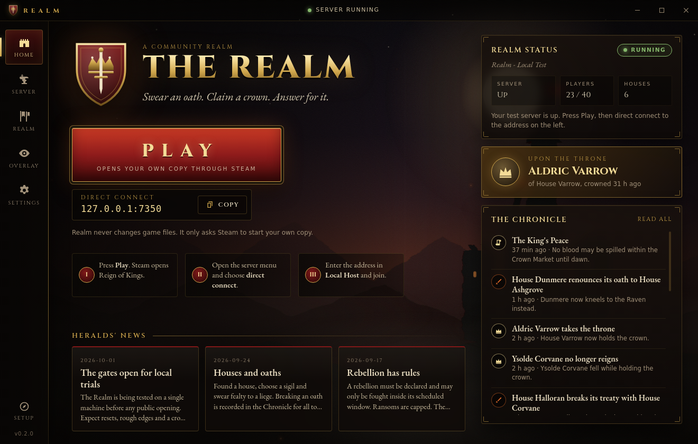

# Realm desktop client

**Realm** is the Windows desktop client for the Realm community server. Players use it to start their own Steam copy of Reign of Kings. The owner also uses it to set up and run the local test server, so the owner never needs a command window.

It **never** reads, patches, repackages or launches game client files. **PLAY** only hands `steam://rungameid/344760` to Windows. Everything that writes goes to the owner's **test copy** of the dedicated server, which must contain the `.realm-test-copy` marker. The Steam copy is only read, once, to make that copy. The client never touches the firewall, the router or `netsh`.



## Install

Run `Realm-Setup-<version>.exe`. It installs for the current Windows user (no admin rights), lets you pick the folder, and adds a desktop and a Start-menu shortcut. `Realm-<version>-portable.exe` runs without installing.

On first start the **setup wizard** opens by itself. You can open it again later with **Setup** at the bottom of the left rail. Steps that are already done are skipped.

| Step | What it does | Mirrors |
|---|---|---|
| Find the server | Looks for `Reign Of Kings Dedicated Server`: first the default `G:\SteamLibrary\steamapps\common\...`, then Steam's path from `reg query HKCU\Software\Valve\Steam /v SteamPath`, then every library in `steamapps\libraryfolders.vdf`. **Choose folder** picks it by hand. | `Realm.ps1` Find-SteamServer |
| Make a test copy | Copies the folder (never moves it) to the test folder, default `G:\RealmTest\server`, showing progress in bytes. It first checks that the drive has room for the copy plus 2 GB. The copy goes into a hidden staging folder, which is renamed into place only when complete. A failed or cancelled copy leaves nothing behind. | `New-TestServer.ps1` |
| First start | Only runs if `Configuration\ServerSettings.cfg` is missing. Starts the server once, waits until the settings file exists and the server has loaded, then sends `quit`. If the server is still running after 90 s it is force stopped (it is a fresh world). The newest console line is shown, so any question from the server is visible. | `Realm.ps1` step 2 |
| Download Oxide | Downloads `Oxide.ReignOfKings.zip` 2.0.3867 from GitHub through Windows' network settings (proxies are honoured), with progress. The file is saved to `<realm folder>\downloads\` as `.part`, its SHA-256 is checked against `6c35c623…c6c8`, and only then is it renamed. A file that is already there and passes the check is reused. | `Realm.ps1` step 3 |
| Install Oxide | Refuses while the server runs. Checks the hash again. Every zip entry must be under `ROK_Data/` with no `..`, absolute paths or drive letters. Entries are redirected to the detected `*_Data\Managed` folder (`ROK_Data` preferred). Each file that will be overwritten is copied to `_realm-backups\oxide-<time>\files\`, and `install.json` lists what was overwritten and what was created. If the extraction fails, the originals are put back automatically. | `Install-Oxide.ps1` |
| Raise the banners | Copies the bundled `plugins\*.cs` into `oxide\plugins` (or `Saves\oxide\plugins` if Oxide made that). Unchanged files are skipped. Replaced files are saved to `_realm-backups\plugins-<time>\`. Other plugins are left alone. | `Deploy-Plugins.ps1` |

The **test folder** rules are the same as in `RealmCommon.ps1`. It must be a full path on a local drive, not on `C:`. No part of the path may be `steamapps`, `Steam` or `SteamLibrary`. It must not overlap the Steam server folder or the Steam install, and it must not be the top of a drive. Every write operation also needs the `.realm-test-copy` marker.

## Screens

| Screen | What is on it |
|---|---|
| **Home** | PLAY, the direct-connect address with a Copy button, how to join, realm status (server state, players, houses), the king, the latest Chronicle events and the news. |
| **Server** | Start, Stop, Restart, and Force stop (offered while a stop is pending or late). There is a live console and a command box (for example `oxide.version`). The Upkeep panel has **Update plugins**, **Back up world**, **Restore backup** and **Undo Oxide**. |
| **Realm** | The throne, the king's council, open claims and decrees in force, and every house with its sworn vassals beneath it. |
| **Overlay** | The OBS address `http://127.0.0.1:8787/overlay` with a Copy button, a live preview, and the folder the Chronicle reads. |
| **Settings** | Test folder, server program (`Server.exe` or `ROK.exe -batchmode -nographics -silentcrash`), Steam server folder, server name / max players / game port (written into `ServerSettings.cfg`), Discord link and the news list. |

Screenshots: [setup](../docs/img/client-setup.png), [setup in progress](../docs/img/client-setup-progress.png), [setup error](../docs/img/client-setup-error.png), [setup done](../docs/img/client-setup-done.png), [server](../docs/img/client-server.png), [restore](../docs/img/client-server-restore.png), [realm](../docs/img/client-realm.png), [overlay](../docs/img/client-overlay.png), [settings](../docs/img/client-settings.png).

### How the server is run

- **Start** first applies the local-only settings from `Start-LocalServer.ps1`, but only to keys that already exist in the files. Each changed file is copied to `_realm-backups\config` first. The settings are `bindIP = '127.0.0.1'` and `isPrivate = 'True'` in `ServerSettings.cfg`, and `rConPort = '27016'` and `enableRCon = 'False'` in `ConsoleSettings.cfg`.
- It then starts `Server.exe` (or `ROK.exe`) from the test copy. The working directory is the server folder, input and output are piped and there is no console window. Console lines are streamed into the Server screen. If the server writes nothing to its output, the newest file in `<server>\Logs\` is followed instead.
- **Stop** sends `quit` to the server and waits. **Force stop** ends the process tree (`taskkill /T /F`). Closing Realm while the server runs asks first, then sends `quit` and force stops after a minute.
- Before Install/Undo Oxide, Restore or saving server settings, Realm checks that no `Server.exe` or `ROK.exe` from the test folder is running. It does this with a hidden `Get-Process` call.
- **Back up world** zips `Saves\` and `oxide\data\` with a `realm-backup.json` manifest into `<realm folder>\backups\realm-saves-<time>.zip`. The `<realm folder>` is the parent of the test folder, so `G:\RealmTest\backups` by default. The zip is written as `.part` and renamed when complete.
- **Restore backup** checks the manifest and that every entry is under `Saves/` or `oxide/data/`. It makes a safety backup (`…-pre-restore.zip`) and moves the current folders to `_realm-backups\pre-restore-<time>\`, so nothing is deleted. Then it extracts the backup. If the extraction fails, the moved folders are put back.
- **Undo Oxide** restores the newest `oxide-<time>` backup, removes the files Oxide added, and renames the backup to `…-rolledback`.
- **Settings** changes `serverName`, `maxPlayers` and `portNumber` with the same rule as `Set-RealmCfgValues`. Only existing `key = '...'` lines are rewritten, and the file's encoding and line endings are kept. Missing keys are reported and never appended. Values with quotes or line breaks are refused.

### The Chronicle overlay

`chronicle/server.js` is bundled as a resource and loaded **inside** the client with `createApp`. It listens on `127.0.0.1:8787` only. It reads `<test folder>\oxide\data`, or `Saves\oxide\data` if that is where the plugin data is. Node.js is not needed. If port 8787 is already taken, for example by a Chronicle started from `Realm.bat`, Realm uses that one and says so.

The Chronicle sends `frame-ancestors 'self'`. To show the preview, Realm removes that one directive for sub-frames loaded from `http://127.0.0.1:8787` inside its own window only. OBS and browsers still get the original header.

## Security

- `contextIsolation: true`, `sandbox: true`, `nodeIntegration: false`, no `<webview>`. New windows are denied, and the main frame cannot navigate.
- The renderer CSP is `default-src 'none'`. Scripts, styles and fonts come from the app itself. The only frame allowed is `http://127.0.0.1:8787`, and `connect-src` is `'none'`.
- `preload.js` exposes named calls only. IPC is accepted only from the app's main frame, and every argument is validated in the main process (enums, string lengths, integer ranges, settings and news schemas).
- `shell.openExternal` is only called with `steam://rungameid/<digits>`, an `https://` link, or `http://` to 127.0.0.1/localhost. The renderer sends a link id (`discord`, `chronicle`, `overlay`), never a URL.
- The Realm screen reads council names, open claims and active decrees from `CrownAndConsequences.json`. Steam ids and every other field are dropped.

## Files

| Path | Purpose |
|---|---|
| `main.js` | Window, IPC, setup steps, server and Chronicle wiring. |
| `preload.js` | The bridge (`window.realm`). |
| `lib/safety.js` | Pure rules: test-folder refusal, cfg key rewrite, zip entry checks (zip-slip), `libraryfolders.vdf` and `reg query` parsing, SHA-256 comparison, settings/news validation. |
| `lib/realm.js` | Disk operations ported from `server/*.ps1`: copy, cfg, Oxide download/install/rollback, plugin deploy, backup/restore, Steam discovery. |
| `lib/server-process.js` | Spawning, console streaming, `quit`/force stop, Logs tail, Windows process check. |
| `lib/chronicle-host.js` | In-process Chronicle on 127.0.0.1:8787. |
| `lib/zip.js`, `lib/fsops.js`, `lib/settings.js` | zip read/write (yauzl/yazl), copy with progress, per-user settings (`%APPDATA%\Realm\realm-settings.json`). |
| `renderer/` | The UI. `fonts/` holds Cinzel and EB Garamond (SIL Open Font License, texts included). |
| `config.json`, `news.json` | Defaults. A copy placed next to `Realm.exe` overrides them. News edited in Settings is stored per user. |

## Develop, test, build

```
npm install
npm start               # run the client
npm run check           # syntax of every script + every element id the UI uses exists
npm test                # unit tests (node --test): safety rules and disk operations on temp folders
npm run screens         # under xvfb-run: drives every screen with an imitation Server.exe and writes docs/img/client-*.png
npm run preview         # renderer only, in a browser with mock data (http://127.0.0.1:5178)
npm run dist:win        # dist/Realm-Setup-<version>.exe (NSIS) and dist/Realm-<version>-portable.exe
```

`npm run screens` needs Playwright. It runs `--no-sandbox` because build containers run as root. Pass `--oxide-zip <path>` if the machine cannot download from GitHub. Two development-only environment variables are ignored by the installed app: `REALM_USER_DATA` (a separate profile folder) and `REALM_DEV_STEAM_SERVER` (an extra place to look for the server).

Building the NSIS installer on Linux needs `wine`, which electron-builder uses to create the uninstaller. On Windows no extra tools are needed. `build.publish` is `null`, so a build never uploads anything.

## Not verified

Everything specific to Windows has only been reasoned about, not run:

- how `Server.exe` behaves with piped input and output (whether it prints to stdout, whether `quit` on stdin works, whether it asks a question on first start);
- the `reg query` lookup;
- `taskkill` and the `Get-Process` check;
- `net.fetch` through a real Windows proxy;
- the installed shortcuts.

The smoke test in `docs/smoke-test.md` still applies. If `Server.exe` does not cooperate with piped I/O, switch **Settings > Server program** to `ROK.exe`. `Realm.bat` remains as a fallback.
