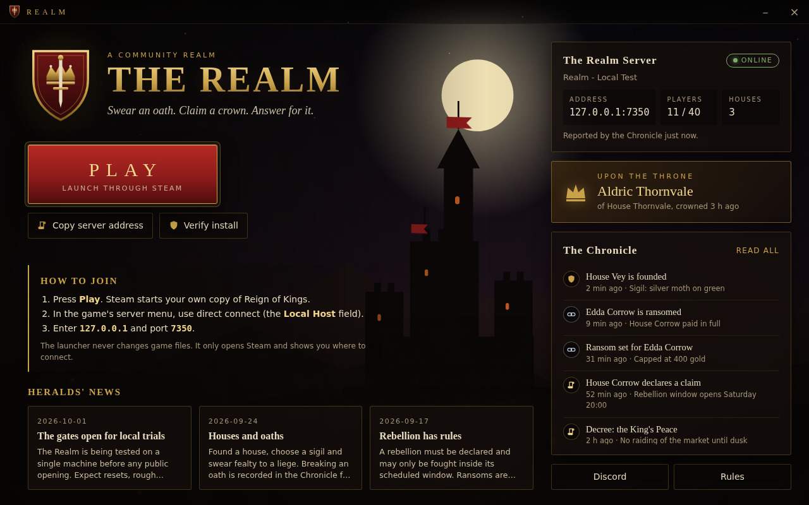

# Realm launcher

An Electron launcher for the Realm server. It does **not** read, patch or ship any Reign of Kings files.

- **PLAY** opens `steam://rungameid/344760`, so Steam starts the player's own copy. No connect info is passed. Auto-connect (`steam://connect/...` or launch options) is UNVERIFIED for RoK. See `docs/server-reference.md` §3.
- **Copy server address** copies `address:port` from `config.json`. The on-screen steps follow the connect method in `docs/server-reference.md` §3: direct connect / "Local Host" field, port 7350 by default. That method is VERIFIED-SECONDARY, so check it in-game.
- **Verify install** checks only whether a folder in `installPaths` exists.
- The **server card, king and Chronicle feed** come from the chronicle service (`GET /api/state`, `GET /api/events?since=<id>`). The main process fetches them, so the renderer has no network access (`connect-src 'none'`).
- The **news panel** reads `news.json`.



## Configuration

`config.json` (a copy placed next to `Realm.exe` overrides the bundled one):

| Key | Meaning |
|---|---|
| `chronicleUrl` | Base URL of the chronicle service. Default is `http://127.0.0.1:8787`. Must be `http(s)` without credentials, otherwise the default is used. The first load fetches the latest 20 events, then polls with `since=<last id>`. |
| `pollSeconds` | Refresh interval. The minimum is 5. |
| `server.address` / `server.port` | The address shown and copied. 7350 is the default game port (`portNumber`). |
| `steamAppId` | 344760, the Reign of Kings client. |
| `installPaths` | Folders checked by "Verify install". The client folder name `Reign Of Kings` is UNVERIFIED. Set it to the real path under `steamapps\common`. |
| `links` | `{id, label, url}` buttons. Only `https://` URLs, or `http://` to 127.0.0.1/localhost, are accepted; anything else is dropped. `shell.openExternal` is only ever called with `steam://rungameid/<digits>` or such a URL. The `chronicle` id becomes the "Read all" link. |

The status pill shows **Online** when the Chronicle has reported within the last 2 minutes and **Quiet** when its last report is older. It shows **Unreachable** when the service does not answer. The launcher does not ping the game port itself.

## Run

```
npm install
npm start              # Electron
npm run preview        # renderer in a normal browser at http://127.0.0.1:5178 (mock data; add ?offline)
npm run screenshot     # writes docs/img/launcher.png (needs playwright + Chromium; CHROMIUM_PATH overrides)
npm run dist:win       # portable Windows exe in dist/ (build on Windows, or on Linux with wine)
```

## Security

- `contextIsolation: true`, `sandbox: true`, `nodeIntegration: false`, and a strict CSP.
- `preload.js` exposes nine named calls. IPC is accepted only from the app's own main frame.
- The renderer never sees link URLs. It sends a link id, and the main process opens the URL from config.
- New windows are denied and in-page navigation is blocked.
- `renderer/mock-preload.js` activates only over http(s), never under Electron's `file://`.
