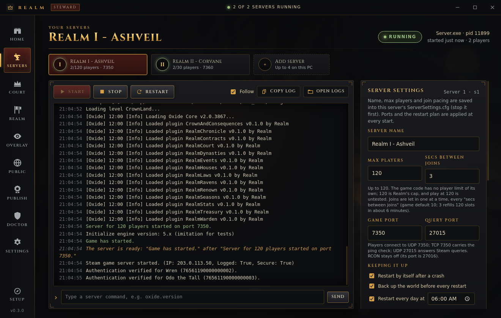
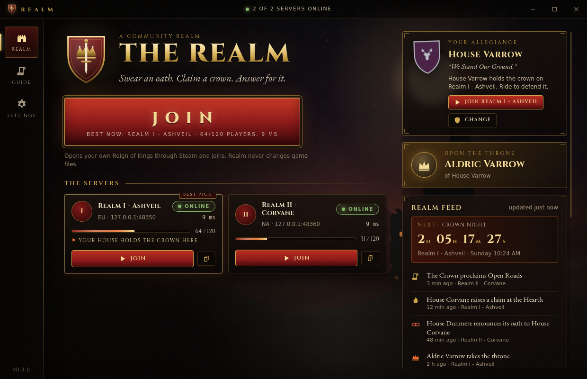
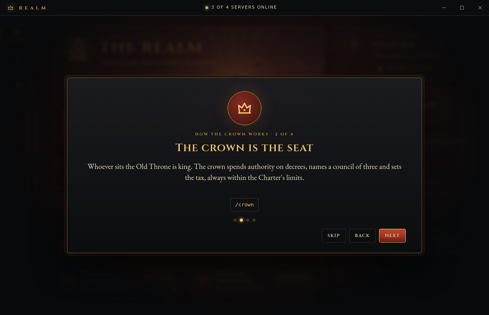
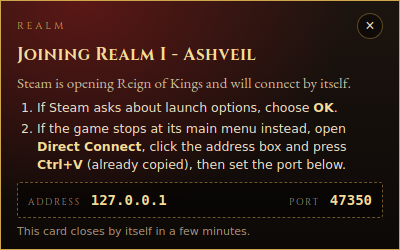
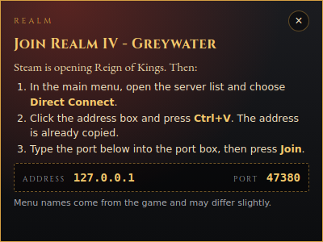

# Realm desktop apps: Realm Steward and Realm

One codebase builds two Windows apps:

| Edition | Who uses it | Installer | What it can do |
|---|---|---|---|
| **Realm Steward** | the owner | `Realm-Steward-Setup-<version>.exe` (`npm run dist:steward`, also `npm run dist:win`) | Everything the earlier Realm client did, and now also: up to **4 server instances**, up to **120 players** each, crash restarts, daily restarts, backups before restarts, **Go Public** and **Publish server list**. |
| **Realm** | players | `Realm-Setup-<version>.exe` (`npm run dist:player`) | Shows the signed server list with live status, **Join** and **Join best server** through the player's own Steam copy, `realm://join/<id>` links, install check, tray notifications and a first-run intro. It contains **no** server, setup, firewall or signing code. |

Neither app reads, patches, repackages or launches game client files. Every game launch is a `steam://` URL from a fixed allow-list, handed to Windows, so the player's own Steam starts the player's own copy through its Easy Anti-Cheat launcher. Everything the steward writes goes to the owner's **test copies** of the dedicated server (each marked `.realm-test-copy`), never to a Steam folder.

The owner's step-by-step guide is [`docs/going-public.md`](../docs/going-public.md). The research behind the joining and port choices is in [`docs/join-and-scale.md`](../docs/join-and-scale.md) and [`docs/seamless-design.md`](../docs/seamless-design.md).




---

## Realm Steward (owner)

### Install

Run `Realm-Steward-Setup-<version>.exe`. It installs for the current Windows user only (no admin rights), lets you pick the folder, and adds desktop and Start-menu shortcuts. `Realm-Steward-<version>-portable.exe` runs without installing. It replaces the earlier owner app "Realm" 0.2.0 (same app id) and keeps its settings in the same profile folder, `%APPDATA%\Realm`.

On first start the **setup wizard** opens by itself. You can reopen it later with **Setup** at the bottom of the left rail. Finished steps are skipped.

| Step | What it does | Mirrors |
|---|---|---|
| Find the server | Looks for `Reign Of Kings Dedicated Server`: first the default `G:\SteamLibrary\steamapps\common\...`, then Steam's path from `reg query HKCU\Software\Valve\Steam /v SteamPath`, then every library in `steamapps\libraryfolders.vdf`. **Choose folder** picks it by hand. | `Realm.ps1` Find-SteamServer |
| Make a test copy | Copies (never moves) the folder to the server's folder, default `G:\RealmTest\server`, with progress. It checks for room for the copy plus 2 GB, copies into a hidden staging folder and renames it into place only when complete. | `New-TestServer.ps1` |
| First start | Runs only if `Configuration\ServerSettings.cfg` is missing. Starts the server once until the settings file exists. On its very first run the game writes the file and exits by itself ("This is the first time you have run this server.", [DEC] `CoreServer`); Realm counts that as success. | `Realm.ps1` step 2 |
| Download Oxide | Downloads `Oxide.ReignOfKings.zip` 2.0.3867 through Windows' network settings, saves it as `.part`, checks SHA-256 `6c35c623…c6c8`, then renames it. One download serves every server. | `Realm.ps1` step 3 |
| Install Oxide | Refuses while that server runs. Every zip entry must be under `ROK_Data/`. Each file it overwrites is copied to `_realm-backups\oxide-<time>\` first, and a failed extraction puts the originals back. | `Install-Oxide.ps1` |
| Raise the banners | Copies the bundled `plugins\*.cs` into `oxide\plugins`. | `Deploy-Plugins.ps1` |

The **folder rules** are the same as `RealmCommon.ps1`. A folder must be a full path on a local drive, not on `C:`, and not inside `steamapps`, `Steam` or `SteamLibrary`. It must not overlap the Steam server, the Steam install or **another Realm server's folder**, and it must not be the top of a drive. Every write needs the `.realm-test-copy` marker.

### Screens

| Screen | What is on it |
|---|---|
| **Home** | PLAY (Steam only), Server 1's direct-connect address, the "Your realm at a glance" strip (servers up, players, last crash, last backup, next restart), realm status, the king, the latest Chronicle events and the news. |
| **Servers** | A strip with one card per server (I to IV) and **Add server**. For the selected server: Start, Stop, Restart, Force stop, the live console and a command box. **Server settings**: name, max players (up to 120), seconds between joins, game and query ports, restart after a crash, back up before every restart, restart every day at a set time. **Upkeep**: Update plugins (all servers; also the plugin data files, see [Plugin data files](#plugin-data-files)), Back up world, Restore backup, Undo Oxide. |
| **Court** | Live moderation over the game's admin console for the selected server: those present (with Steam IDs from the RealmCourt plugin), kick, mute, ban, unban, ban list, notice, popup, chat, whitelist on/off, save world, the live hall (chat, log, errors), in-game staff commands of the Realm plugins to fill in and copy (one fold per plugin: houses, crown, contracts, laws and court, the Sentinel, monuments, signs, the Ironbreaker, quests, travel and kits, the Arena, Dominion, the living world, the guilds, heraldry and the council), and the Court rolls written to `%APPDATA%\Realm\court\court-log.jsonl`. |
| **Realm** | The throne, the council, open claims and decrees, and every house with its vassals. It follows Server 1's Chronicle. |
| **Overlay** | The OBS address `http://127.0.0.1:8787/overlay`, a live preview and the folder the Chronicle reads (Server 1). |
| **Public** | Go Public for the chosen server: network mode, Windows Firewall rules, router ports, a self-check. |
| **Sentinel** | RealmSentinel's live alerts, suspects ranked by score and each one's evidence, with Kick and Ban over the admin console and the `/sentinel` commands filled in to copy. A badge on the rail counts unseen alerts. See [The Sentinel screen](#the-sentinel-screen). |
| **Publish** | Three tabs, all signed with the same key: the server list (`servers.json`), **News** (`news.json`) and **Player update** (`update.json`). See [Publish news and player updates](#publish-news-and-player-updates). |
| **Doctor** | The Connection Doctor ([`docs/connection-doctor.md`](../docs/connection-doctor.md)): one verdict and one fix for "I can't connect", 11 read-only checks, the game and server logs with known problems highlighted, a paste box for the game's popup text, and a redacted **Copy report**. |
| **Features** | Realm features: each plugin's main switches, saved to `oxide\config\<Plugin>.json` with a backup and reloaded over the admin console. See [Realm features](#realm-features). |
| **Settings** | Server 1's folder, which server program to run (`Server.exe` or `ROK.exe -batchmode -nographics -silentcrash`; it applies to every server), the Steam server folder, the Discord link and the news, and the opt-in **Discord herald** that posts new Chronicle events to a webhook ([`docs/discord-herald.md`](../docs/discord-herald.md)). |

Screenshots: [setup](../docs/img/steward-setup.png), [setup in progress](../docs/img/steward-setup-progress.png), [setup done](../docs/img/steward-setup-done.png), [server](../docs/img/steward-server.png), [crash restart](../docs/img/steward-server-crash.png), [two servers](../docs/img/steward-fleet.png), [restore](../docs/img/steward-server-restore.png), [home](../docs/img/steward-home.png), [realm](../docs/img/steward-realm.png), [overlay](../docs/img/steward-overlay.png), [go public](../docs/img/steward-public.png), [publish](../docs/img/steward-publish.png), [settings](../docs/img/steward-settings.png), [Realm features](../docs/img/steward-features.png), [Realm features live](../docs/img/steward-features-live.png), [Sentinel](../docs/img/steward-sentinel.png), [Sentinel kick](../docs/img/steward-sentinel-kick.png), [Court staff commands](../docs/img/steward-court-commands.png), [publish news](../docs/img/steward-publish-news.png), [publish update](../docs/img/steward-publish-update.png).

### Up to four servers

Each server is a full copy in its own folder, because `Configuration\`, `Saves\` and `Mods\` are relative to the working directory and the game has no config-path argument ([DEC], `docs/join-and-scale.md` §4.2). **Add server** proposes `G:\RealmTest\s<N>\server` (or a folder you pick) and runs the same setup wizard for it. **Remove** only makes Realm forget a server; its folder, world and backups stay on disk.

Ports come from one table (`lib/fleet.js`). Realm refuses duplicates, ports below 1024, the game admin console ports 11000 to 11003, its own Chronicle ports 8786 to 8790, and 8766.

| Server | Folder (default) | Game, UDP (`portNumber`) | Ping, TCP (`pingPort`) | Steam query, UDP (`steamAuthPort`) | RCON port (RCON stays off) |
|---|---|---|---|---|---|
| I | `G:\RealmTest\server` | 7350 | 7350 | 27015 | 27016 |
| II | `G:\RealmTest\s2\server` | 7360 | 7360 | 27025 | 27026 |
| III | `G:\RealmTest\s3\server` | 7370 | 7370 | 27035 | 27036 |
| IV | `G:\RealmTest\s4\server` | 7380 | 7380 | 27045 | 27046 |

The ports are spaced by 10. That way RCON on query+1 never collides with another server's query port, and Server 1 keeps the `rConPort = '27016'` it has always had. Before every start Realm checks that none of the server's ports is already in use.

**UNVERIFIED:** that two or more servers run side by side on one PC. The game hard-codes the Steam client port 8766 ([DEC] `SteamServer.StartServer`). The walk-through ran two imitation servers side by side, not the real game. **UNVERIFIED:** memory and CPU for four servers.

### 120 players

The game reads `maxPlayers` as an `int` with no clamp, and opens its network listener with `int.MaxValue` connections ([DEC], `docs/join-and-scale.md` §2). So **120 is Realm's own cap**, not a game limit. **UNVERIFIED:** whether the server stays playable at 120 players. The game was designed around 30, so a load test is needed before relying on it.

The game lets queued players in one at a time, every `timeBetweenPlayerJoin` seconds (default 10), so 120 players need about 20 minutes to get in. **Secs between joins** edits that existing key. A value of 3 brings it down to about 6 minutes. **UNVERIFIED:** the server load at faster joins.

### How a server is run and kept up

Before every start, Realm writes these values into **keys that already exist** in the server's own files. The previous file is copied to `_realm-backups\config` first, and missing keys are reported, never added.

| File | Values |
|---|---|
| `ServerSettings.cfg` | `bindIP` (`127.0.0.1`, or `0.0.0.0` when the server is public), `isPrivate` (`True`, or `False` if you chose to list a public server in the game browser), `portNumber` and `pingPort` (game port), `steamAuthPort` (query port), `restartTime` (see below) |
| `ConsoleSettings.cfg` | `rConPort` (query port + 1), `enableRCon = 'False'` |

The server program is started from the server's folder with piped input and output and no console window. Its console is streamed into the Servers screen, or `Logs\` is followed when it prints nothing. **Stop** sends `quit`; **Force stop** ends the process tree. Realm never passes `-ip`, which would stop the process being a dedicated server ([DEC]).

**Live console (ROK.exe).** Realm starts `ROK.exe` with `-cport 11000` (Server I; up to 11003 for IV) and holds the game's admin console on 127.0.0.1 for the whole run. Commands typed in the Servers console go to the game and its answers come back, and every line the game logs (warnings and errors in red, exceptions with their stack) streams into the Servers console, because the game's own logger never writes to stdout or `-logFile`; **Stop** sends `/shutdown` (save, then exit). The game does not read stdin, so before this `quit` was most likely ignored. The game saves and stops when this connection closes, so closing Realm Steward stops its servers cleanly. The **Court** screen (players, kick, ban, unban, mute, notices, whitelist, save world, the Court rolls) runs on it. It can be turned off per server on the Court screen; `Server.exe` never gets `-cport`. Details, sources and UNVERIFIED points: [`docs/admin-console.md`](../docs/admin-console.md). Screenshots: [court](../docs/img/court-session.png), [ban](../docs/img/court-ban.png), [console](../docs/img/court-console.png), [offline](../docs/img/court-offline.png).

- **Crash restart.** If a server stops without being asked to, Realm backs up the world, then restarts it after 10 s, 30 s, 1 min, 2 min, then 5 min. A run of 30 minutes or more resets the ladder. Five crashes within 15 minutes, or eight crashes in a row without a 30-minute run, trip the **crash-loop breaker**: Realm stops trying and shows why. Pressing Start clears it. A server that dies within 5 minutes of starting is always treated as a crash, even close to its daily restart time, and each daily restart time is used once.
- **Daily restart.** Realm computes the seconds until the chosen time and writes them into `restartTime` before each start. The game's own `AutoRestart` then announces "The server will be restarting in …" at 60, 30, 15 and 5 minutes and at 30 seconds, and shuts the server down ([DEC] `AutoRestart`). Realm then backs up and starts it again. If the server is still up 5 minutes after the planned time, Realm sends `quit` itself, so the restart happens anyway, without the in-game countdown in that case. **UNVERIFIED** at run time: that the notices appear in game and that `ROK.exe` exits after them.
- **Backup before restart.** Before every automatic restart, Realm zips `Saves\` and `oxide\data\` (labelled `-auto`) and keeps the newest 24 automatic backups.
- Automatic restarts only happen while Realm Steward is open.

Other upkeep works as before: Back up world, Restore backup (the current world is moved aside first) and Undo Oxide. Each acts on the selected server.

### Go Public

The [owner guide](../docs/going-public.md) walks through it. In short, for each server:

1. **Network.** *This PC only* (bindIP `127.0.0.1`) or *Public* (bindIP `0.0.0.0`), plus an optional "list in the game's own server browser" (`isPrivate = 'False'`). `isPrivate` only hides a server from the browser; it is not a password ([DEC]). The change applies at the next start.
2. **Windows Firewall.** Rules are added **only** after you click **Add firewall rules**, read the exact rules in a confirmation and accept the Windows administrator (UAC) prompt. Every rule is scoped to that server's `ROK.exe`:
   - allow UDP game port
   - allow TCP ping port
   - allow UDP query port
   - **block** TCP 11000 to 11003, the game's admin console, which has no password and shuts the server down when its last client disconnects ([DEC] `SocketAdminConsole`)

   **Remove rules** deletes exactly these rule names, again after a UAC prompt. The scripts use PowerShell's `New-NetFirewallRule` and `Remove-NetFirewallRule`, built only from validated numbers and a validated path (`lib/firewall.js`).
3. **Router.** The exact ports to forward and this PC's LAN address. Realm never changes the router.
4. **Check.** Runs a set of checks:
   - Is the server running?
   - Do `bindIP` and the instance ports match what Realm wants?
   - Are the ports actually open?
   - Does an A2S query on this PC and on the LAN address get an answer?
   - Is the public IP that Steam reports, read from the game's `Steam game server started. (IP: …)` line, actually public? Realm warns on CGNAT `100.64.0.0/10` and on private addresses.
   - Can a TCP connection reach the ping port through the public address? Many routers do not loop back, so a failure here is only a warning.
   - Which firewall rules are present?

   Only a friend outside your network can prove that UDP gets through, so the final test is a friend's Realm app showing the server online.

### Publish server list

1. **Create signing key**, once. The Ed25519 key is generated on this PC. The private key is stored in `%APPDATA%\Realm\realm-signing-key.json`, encrypted for your Windows user with Electron `safeStorage` (DPAPI) where available, and never leaves the PC. The screen shows only the public key.
2. Fill in the list:
   - the https address where you will host it;
   - how many days it stays valid (default 30);
   - an optional rules link;
   - for each server you tick: name, region, **public address** (a DNS name is best), max players, and an optional public Chronicle address.

   The ports come from each server's settings.
3. **Sign & write servers.json** writes three files to the folder you chose (default `G:\RealmTest\publish`):
   - `servers.json`, the signed list;
   - `player-config.json`, which holds the public key, the list address and the signed list for building the player app;
   - `PUBLISH-README.txt`.

   **Nothing is uploaded.** The list carries an increasing version number, so player apps refuse an older list (a rollback).

When you run Realm Steward from this repository (`npm start`), a tick box can also copy `player-config.json` straight into `launcher/player/`.

The `servers.json` format is a JSON envelope:

```json
{ "format": "realm-servers/1", "alg": "Ed25519", "keyId": "<16 hex>",
  "payload": "<base64 of the exact list JSON>", "signature": "<base64, 64 bytes>" }
```

The list itself is `{schema: 1, realm, seq, issued, expires, servers: [{id, name, region, address, port, queryPort, maxPlayers, chronicleUrl?}], links?}`. `lib/shared/manifest.js` holds the schema.

### Publish news and player updates

The **News** and **Player update** tabs on Publish write `news.json` and `update.json` into the same folder as `servers.json`, signed with the same key (`lib/news.js` `buildNews`/`signNews`, `lib/updater.js` `buildUpdate`/`signUpdate`; the screen's logic is `lib/publish-feeds.js`). The formats and how the player app reads them are in [`docs/player-launcher.md`](../docs/player-launcher.md). **Nothing is uploaded**: put both files next to `servers.json` where you host it.

- **News.** Up to 60 items: an announcement, a Chronicle highlight (**From the Chronicle** picks a recent entry) or "What's new in the realm" (a new sculpture, a law, an event, with an optional start time). Pinned items come first. Items stay in a draft (`%APPDATA%\Realm\publish\feeds.json`) until you press **Sign & write news.json**. The "As players see it" panel shows the two lists the player app shows.
- **Player update.** **Choose installer** picks `Realm-Setup-<version>.exe` from the release folder. Steward reads its size and SHA-256 from the file and, when the folder has `SHA256SUMS.txt` (`npm run release`), refuses a file that does not match its line. Fill in the https download address (upload the installer there yourself), the patch notes, an optional minimum version (older apps must update) and the hotfix tick, then **Sign & write update.json**.
- Each file carries a version number that only goes up: one more than the highest of Steward's own counter and the file already in the folder signed with this key. A lost profile or a second PC therefore cannot publish a file players would refuse as a rollback.
- Before a file is written it is checked with the public key exactly as the player app checks it, then written atomically. A damaged draft file is never overwritten: the tab says so, and writing stops until you move it away.

### The Sentinel screen

The Sentinel screen reads what RealmSentinel writes ([`plugins/docs/RealmSentinel.md`](../plugins/docs/RealmSentinel.md), "The Steward feed"): `oxide\data\RealmSentinelFeed.json` (alerts, suspects, mode, online and frozen counts) and the evidence log `oxide\logs\RealmSentinel\realmsentinel_evidence-<date>.txt`. It never writes to them. Steward looks for changes every few seconds; a new alert raises a toast and counts on the rail badge until **Mark all seen**.

- **Live alerts**, newest first, with the kind, the score and what the plugin did or would do (`would freeze`, `would kick` in watch mode).
- **Suspects** ranked by score, with a bar against the alert, freeze, kick and ban scores from the plugin's config.
- **Evidence** for the chosen player: every finding from the daily logs, newest first, with position and ping.
- **Kick** and **Ban** are the game's own `/kick` and `/ban` over the admin console, with the reason `Sentinel: <kind>`. They go through the Court, so they land in the Court rolls. Ban asks first. **Reload plugin** sends `/oxide.reload RealmSentinel`.
- **Report**, **Freeze 15 min**, **Unfreeze**, **Clear score** and **Sentinel ban** copy the `/sentinel` command, with the player's name quoted, for an admin to paste in game. Oxide runs a plugin's chat command only for a player, and the admin console is not one, so Steward cannot send these itself.

### Realm features

The **Features** screen lists every Realm plugin with its main switches (`lib/features.js` `CATALOGUE`). A test checks each switch against the plugin's `PluginConfig`, and that every plugin with a config is listed. Turning a switch:

1. reads `oxide\config\<Plugin>.json` and refuses if it does not parse (the plugin then runs on its defaults; fix or delete the file);
2. changes exactly the bytes of that one value. Everything else (64-bit Steam IDs, number formats, order) stays byte for byte, and the result is parsed again and must differ in that one value only;
3. copies the old file to `<server>\_realm-backups\config-<time>\` and writes the new one through a temporary file. If the file changed on disk meanwhile, nothing is written;
4. on a running server with the live console, sends `/oxide.reload <Plugin>` so the change applies at once. A stopped server picks it up at its next start. Each change is written to the Court rolls.

A dangerous switch (the Sentinel's enforce mode, ban by itself) asks first. A master switch (for example "Quests" or "Guilds") dims the plugin's other switches while it is off. **More switches** lists every other true/false value in the file. A plugin that has not written its config yet says "no config yet: start the server once".

### Plugin data files

Some plugins read files Realm ships rather than files they write. **Update plugins** (and the setup step "Raise the banners") copies them before the plugins:

| Files | To | Read by |
|---|---|---|
| `art/sculptures/*.json` | `oxide\data\RealmSculptor\` | RealmSculptor (monuments) |
| `art/paintings/RealmPainterArt.json` | `oxide\data\` | RealmPainter (sign art; the Features screen shows its version) |
| `plugins/docs/RealmQuests/content/*.json` | `oxide\data\RealmQuests\` | RealmQuests (tasks, story, deeds, places) |

Every source file must parse as a JSON object first; a damaged or truncated one is not copied and the server's copy is left as it is. A changed file on the server is saved to `_realm-backups\data-<time>\` before it is replaced. Files you added yourself (your own sculpture) are listed but never touched. Each copy is written to `<name>.realm-part` and renamed into place. A running server reloads the plugins whose data changed over the admin console. In the installer the files are under `resources\realm-data` (`build/steward.json` `extraResources`). The Features screen shows each set and whether it still needs deploying.

---

## Realm (player)

### Install and first start

Run `Realm-Setup-<version>.exe`. It is a per-user install, with no admin rights, and it registers `realm://` links for that user. Its profile is `%APPDATA%\Realm Player`.

The first start shows a five-card intro (houses, oaths, the crown, rebellion windows, ransom, then the rules link). It can be replayed from **Guide**.



### The server list

The app downloads `servers.json` from the https address built into it and accepts it **only** if the Ed25519 signature matches the public key built into it. Otherwise it falls back, in this order:

1. the last good list it downloaded, marked "Saved copy" (and stale after it expires);
2. the signed list bundled in the build;
3. a single local test server (`127.0.0.1:7350`, "Test only").

It refuses:
- unsigned lists;
- lists signed by another key;
- lists with a changed byte;
- lists that have expired;
- lists dated in the future;
- lists **older** than one it has already seen (anti-rollback).

Server addresses and ports **only** come from the signed list. Links never carry them.

### Status, join and join best server

Each card shows the server's status as Online, Full, Offline or Unknown, along with ping, players and a fill bar.

- **Ping and liveness** come from Steam's A2S query on the server's query port (`steamAuthPort`, [DEC]). The game always reports its name as "Another ROK Server" and max players as 0 over A2S ([DEC]). So names and slots come from the signed list, and A2S player counts are shown as approximate (`~4 / 120`, **UNVERIFIED** accuracy).
- **Players and the crown** come from the server's public Chronicle `/api/state`, when the owner lists one.
- **Join best server** never picks a server that is known to be offline. It avoids full servers, where the game would queue the player, prefers servers that are 30 to 90% full, and then lower ping. The button says which server it picked and why.

**How JOIN works**, in the most seamless order the research supports:

| Step | What happens | Evidence |
|---|---|---|
| 1 | Checks that Steam and Reign of Kings are installed. It reads `HKCU\Software\Valve\Steam\SteamPath`, `libraryfolders.vdf` and `appmanifest_344760.acf`, read-only. If the game is missing, it offers `steam://install/344760` (or the Steam download page). | generic Steam |
| 2 | **Join directly** (default) opens `steam://run/344760//-ip <host> -port <port>/`. Steam starts the player's own copy through its EAC launcher with those arguments, and the game's `QuickJoinBypass` calls `Game.Join(ip, port)` at start-up. `-pass` and `-rejoin` are never sent. | [DEC] `QuickJoinBypass`, `SystemUtil.CommandLineProps`; **UNVERIFIED:** that the EAC bootstrapper forwards the arguments, whether Steam shows a launch-options dialog, and whether the retail client scene contains `QuickJoinBypass` (`docs/seamless-design.md` T1 to T3) |
| 3 | In every case the address is copied to the clipboard, and a small **always-on-top card** shows the address and port, with exactly where to paste them if the game opens at its main menu: Direct Connect, address box, Ctrl+V, then the port. | **UNVERIFIED:** the in-game menu wording |
| alt | **Classic** (Settings) only opens `steam://rungameid/344760` and shows the same card. | |

`steam://connect` is not used, because the game ignores `+connect` ([IL]). Writing the game's `Lobby History.bin` or `Lobby Mirrors.cfg` would put Realm servers in the in-game browser, but it is **not done**: both files belong to the player's game install or profile and need the owner decisions D1/D3 in `docs/seamless-design.md`.

 

### Links, tray and notifications

- `realm://join/<server id>` opens Realm and asks **"Join <server>?"** first. Only `realm://join/` followed by an id that is in the signed list is accepted. Ids are 1 to 24 lower-case letters, digits or `-`. Anything else (another action, a query string, a host, an unknown id) is refused with a message, and nothing starts. Discord does not turn `realm://` into a clickable link, so post the https download page alongside it.
- **Keep Realm in the tray** (Settings) hides the window instead of quitting. The tray menu has Open, Join best server and Quit.
- **Notifications** (Settings, off by default) poll each listed Chronicle's `/api/events` every 60 s. They show a Windows notification for coronations, abdications, claims and rebellions. Old history never floods the tray, because the first poll only sets a baseline.

Screenshots: [home](../docs/img/player-home.png), [link confirmation](../docs/img/player-deeplink.png), [not installed](../docs/img/player-install.png), [guide](../docs/img/player-guide.png), [settings](../docs/img/player-settings.png).

---

## Security

- Both editions use these window settings: `contextIsolation: true`, `sandbox: true`, `nodeIntegration: false`, no `<webview>`, new windows denied, and no navigation of the main frame. IPC is accepted only from the app's own main frame, and every argument is validated in the main process: ids, enums, string lengths and integer ranges.
- **The player edition has no server-control code at all.** It has its own entry point (`player/main.js`) and preload (`player/preload.js`), and its electron-builder config packs only `player/`, `lib/shared/` and the player renderer files. `test/player-edition.test.js` checks:
  - the require graph of the entry points;
  - that the exposed API and every channel it reaches are `app:` or `player:` only;
  - that no spawn, firewall or `safeStorage` code is present;
  - the packed file list.

  The built `app.asar` was also listed and searched: it holds 29 entries and no steward strings.
- `shell.openExternal` takes only these `steam://` URLs (`lib/shared/steam.js`):
  - `steam://rungameid/344760`
  - `steam://install/344760`
  - `steam://run/344760//-ip%20<host>%20-port%20<port>/`, where the host is a DNS name or IPv4 and the port is 1 to 65535

  Other links must be `https://`. In the steward only, plain `http://` is also allowed to 127.0.0.1.
- The steward's firewall scripts run only after an in-app confirmation, a native confirmation listing the exact rules, and the Windows UAC prompt. They are built from validated numbers and a validated path, and passed with `-EncodedCommand`.
- The signing key is generated locally, and the private key is never shown, logged or uploaded. The player build holds only the public key.

## Files

| Path | Edition | Purpose |
|---|---|---|
| `main.js`, `preload.js` | Steward | Window, IPC, fleet, setup, supervisor, Go Public, Publish. |
| `player/main.js`, `player/preload.js`, `player/player-config.json` | Player | Signed list, status, join, links, tray. The config carries the public key and list address. |
| `lib/shared/` | both | `manifest.js` (schema, Ed25519 verify), `steam.js` (VDF, install check, `steam://` allow-list), `a2s.js` (A2S_INFO), `deeplink.js`, `pick.js` (best server), `notify.js` |
| `lib/fleet.js`, `lib/supervisor.js`, `lib/firewall.js`, `lib/publish.js`, `lib/netcheck.js` | Steward | Port table and instances, crash/daily restart decisions, firewall command construction, signing, network facts |
| `lib/safety.js`, `lib/realm.js`, `lib/server-process.js`, `lib/chronicle-host.js`, `lib/zip.js`, `lib/fsops.js`, `lib/settings.js` | Steward | Unchanged roles: path and cfg rules, disk operations, process control, in-process Chronicle |
| `renderer/index.html`, `app.js` | Steward | UI |
| `renderer/player.html`, `player.js`, `player.css`, `coach.*` | Player | UI and the join card |
| `renderer/styles.css`, `renderer/fonts/` | both | Shared look; Cinzel and EB Garamond (SIL OFL) |
| `build/steward.json`, `build/player.json` | | electron-builder configs (`publish: null`, so a build never uploads anything) |

## Develop, test, build

```
npm install
npm start               # Realm Steward
npm run start:player    # Realm (player)
npm run check           # syntax of every script; every element id each page's script uses exists
npm test                # unit tests (node --test)
npm run screens         # xvfb-run: steward walk-through with an imitation server -> docs/img/steward-*.png
npm run screens:player  # xvfb-run: player walk-through with a signed list and imitation servers -> docs/img/player-*.png
npm run dist:steward    # dist/Realm-Steward-Setup-<v>.exe and dist/Realm-Steward-<v>-portable.exe
npm run dist:player     # dist/Realm-Setup-<v>.exe and dist/Realm-<v>-portable.exe
npm run dist:win        # same as dist:steward
```

- The unit tests cover:
  - signature verification: tampering, wrong key, unsigned, expired, rollback, future dates;
  - the `servers.json` schema;
  - A2S packet build and parse, including the challenge, with a live query against a fake server;
  - deep-link parsing;
  - the `steam://` allow-list and install detection;
  - port allocation and fleet checks;
  - crash backoff, the breaker and daily-restart maths;
  - firewall command construction;
  - the best-server pick and notifications;
  - the player-edition separation;
  - all the earlier safety and disk tests.
- `npm run screens` takes `--oxide-zip <path>` when the machine cannot download from GitHub. It runs Electron with `--no-sandbox` because build containers run as root.
- These development-only variables are ignored by installed apps:
  - `REALM_USER_DATA`
  - `REALM_DEV_STEAM_SERVER`
  - `REALM_DEV_PLAYER_CONFIG`
  - `REALM_DEV_GAME_INSTALL=missing`
  - plain `http://127.0.0.1` list addresses in the player
- Building the NSIS installers on Linux needs `wine`.
- The player build in this repository ships with **no public key**, so it shows only the local test server. Run **Publish** in Realm Steward, put the resulting `player-config.json` into `launcher/player/`, then run `npm run dist:player`.

## Not verified

Everything Windows-specific has only been reasoned about here, not run:

- `Server.exe` with piped I/O, and the `ROK.exe` fallback;
- `reg query`, `taskkill` and `Get-Process`;
- the firewall scripts and the UAC flow;
- DPAPI through `safeStorage`;
- the installers and shortcuts, and the `realm://` registration;
- tray icons and notifications;
- whether quick join survives the EAC bootstrapper;
- whether four real servers coexist;
- play at 120 players;
- the Steward screens for the server plugins, listed below.

**UNVERIFIED on the real server**, each with its test:

| # | What | Test |
|---|---|---|
| F1 | `/oxide.reload <Plugin>` sent over the admin console reloads the plugin. | Start Server 1 from Steward with the live console. On Features, turn RealmEvents "Truce of the Realm" off. The live hall shows `Unloaded plugin RealmEvents` then `Loaded plugin RealmEvents`, and `oxide\config\RealmEvents.json` has `"EnableTruce": false`. |
| F2 | A plugin keeps a config Steward edited (it does not write its old value back). | After F1, restart the server. The switch is still off on Features and in the file. |
| S1 | RealmSentinel writes `RealmSentinelFeed.json` and the evidence log in the documented shape. | With the Sentinel in watch mode, a second account without admin rights floods chat (more than 12 lines in 10 s, six times over, so its score passes `AlertScore` 20 at 4 points a flood). Within 10 s the Sentinel screen lists the alert, and the account's evidence shows the line. |
| S2 | Kick and Ban from the Sentinel screen. | Kick the test account from its evidence. It is disconnected with the reason `Sentinel: <kind>`, and the Court rolls show the kick. |
| D1 | RealmSculptor, RealmPainter and RealmQuests read the deployed data. | Update plugins, then in game as an admin: `/sculpt list` lists the sculptures, `/paint status` shows the art version from the Features chip, `/quest admin status` shows six content files ok. |
| C1 | The copied staff commands work as typed. | From the Court, copy `/arena admin status`, `/quest admin status` and `/world admin status` and paste them in game as an admin. Each answers. |
| P1 | The player app accepts the published `news.json` and `update.json`. | Host both next to `servers.json`. A player app shows the news on Play and offers the update, and refuses it after one byte of the hosted installer is changed. |

The tests to run on the owner's PC are listed in [`docs/going-public.md`](../docs/going-public.md) and `docs/seamless-design.md` §7.
