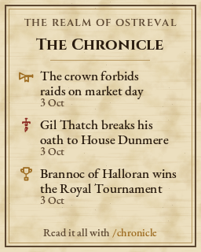
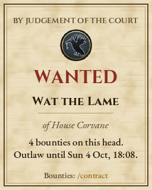
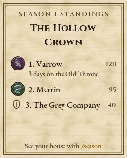
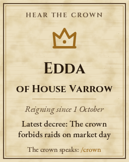
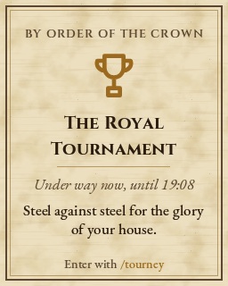
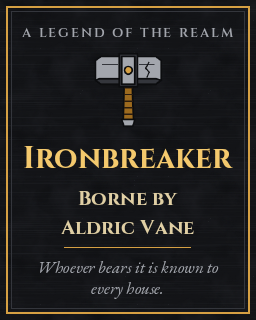

# RealmPainter: Realm's art on the game's painted signs

`plugins/RealmPainter.cs` (Oxide 2.0.3867, C# 3) puts Realm's own art into the game world through the one feature that carries real images from a server to every player: **painted signs** ([`docs/in-game-art.md`](../../docs/in-game-art.md)). An admin looks at a sign and types `/paint crest-varrow`; the plugin writes the picture into the sign and raises the game's own paint update, so every client gets it. Signs can also be bound to **live boards** that redraw themselves: the Chronicle, wanted posters, season standings, the monarch's proclamation, event posters and the Ironbreaker.

Status: **compiles with 0 errors against the real 2.0.3867 DLLs, and is behaviour-tested against mocks (122 checks pass, plus 4 checks in Node that decode every PNG the plugin's encoder wrote). It has never run on a live server.** Whether the game accepts a picture set by the server is the first thing to test: see [First test on a real server](#first-test-on-a-real-server) and [What is UNVERIFIED](#what-is-unverified).

No game file is touched and nothing is installed on players' machines. Players can already paint signs themselves; the plugin only fills them in, with original Realm art (`art/`) and the brand fonts (SIL OFL 1.1). RealmPainter writes nothing to the Chronicle, so **no new Chronicle event types are needed**.

---

## What players see

Signs in the world that show house crests, banners, event posters and the Realm emblem, in the same art as the launcher and the portal. Live boards change on their own:

| | | |
|---|---|---|
|  |  |  |
|  |  |  |

These previews are the plugin's own output, drawn by the behaviour tests with mock data (`PREVIEWS=1 plugins/docs/RealmPainter/logic-tests/run.sh` refreshes them). Wide faces get a landscape layout ([chronicle](RealmPainter/previews/board-chronicle-wide.png), [notice](RealmPainter/previews/board-notice-wide.png)).

## Setting it up

1. Deploy `plugins/RealmPainter.cs` with the other plugins.
2. Copy **`art/paintings/RealmPainterArt.json`** to **`<server>/oxide/data/RealmPainterArt.json`**. It holds every painting, sprite and glyph atlas (2.8 MB). Without it the plugin loads, says so in the log, and paints nothing.
3. Grant the permission: `oxide.grant group realm_admin realmpainter.admin` (and `realm_host` for event hosts; see [`staff-roles-and-permissions.md`](../../docs/community/ops/staff-roles-and-permissions.md)).
4. In game, place a sign, look at it and type `/paint list`, then `/paint crest-varrow`.

## Commands

All need `realmpainter.admin`. "The sign" is the one you look at (within `MaxReach`, 8 m), or, if you look at none, the one you stand next to (within `NearRadius`, 3 m). The reply always names the sign it chose, how far away it is and how it was found (`look`, `aim` or `near`).

| Command | What it does |
|---|---|
| `/paint <artwork>` | Binds the sign to a finished painting and paints it now. |
| `/paint chronicle` | Binds it to the Chronicle board. |
| `/paint wanted [n]` | The n-th outlaw's wanted poster (1 = most bounties). |
| `/paint standings` | The season's house standings. |
| `/paint proclamation` | The monarch, their house and the latest decree. |
| `/paint event [kind]` | The running or next event; with a kind (`crown_night`, `tournament`, `kings_hunt`, `truce`) always that event. |
| `/paint ironbreaker` | The Ironbreaker and who bears it. |
| `/paint notice <title> \| <text>` | An admin's own sign: directions, rules, a welcome. |
| `/paint list` | Every artwork id and live board. |
| `/paint info` | What the sign shows, its face, when it was last drawn and the last error. |
| `/paint nearby` | Every paintable object within 20 m, nearest first, with its face size. This is how to find out which placeables are paintable. |
| `/paint signs` | The registry: every bound sign, what it shows, how far away. |
| `/paint redraw [id\|all]` | Draws again now. Skips the per-sign interval but keeps to the server's budget; the rest waits in the queue. |
| `/paint face [calibrate\|auto\|save\|<w> <h> [x y]]` | Shows or sets where on the sign the picture goes. See [Fitting the picture](#fitting-the-picture-to-a-sign). |
| `/paint fit fit\|fill` | Keep the picture's shape inside the face (default), or stretch it over the whole face. |
| `/paint unbind [id]` | Frees the sign. Its picture stays until someone paints over it. |
| `/paint clear [id]` | Blanks the sign and frees it. |
| `/paint forget <id>` | Drops a record whose sign is gone. |
| `/paint status` | Signs, queue, redraws and bytes in the last minute, the art version and which source plugins are loaded. |
| `/paint reload` | Reads the art bundle again after a new one is copied in; live boards are looked at again. |

`/paint` is a staff command, so RealmHerald's `/realm` hub for players leaves it out (`STAFF_COMMANDS` in `tools/realm-integration/check.mjs`).

## Artworks

Built by `art/tools/painter` from the art pack. `/paint list` shows the ids.

| Group | Ids | Size |
|---|---|---|
| House sigils | `sigil-varrow`, `sigil-ashgrove`, `sigil-corvane`, `sigil-dunmere`, `sigil-halloran`, `sigil-merrin` | 256 x 256 |
| House banners | `banner-<house>` | 160 x 272 |
| House notices (sigil, name, words) | `crest-<house>` | 256 x 320 |
| Event posters | `poster-crown-night`, `poster-royal-tournament`, `poster-kings-hunt`, `poster-truce` | 256 x 320 |
| Welcome | `poster-welcome` | 320 x 256 |
| Ironbreaker (static) | `poster-ironbreaker` (the live board names the bearer) | 256 x 320 |
| Realm emblem | `realm-emblem` | 256 x 256 |

A finished painting goes into the sign exactly as built, so it looks the same on every sign. Paintings over `MaxImageSide` or `MaxPngBytes` are left out when the bundle loads, and the log says which.

## Live boards

| Board | Shows | Source | When there is nothing to show |
|---|---|---|---|
| `chronicle` | The latest `ChronicleRows` (5) entries, each with its event icon (`art/icons/event-map.json`), title and date. Rows that do not fit are dropped from the bottom. | `RealmChronicle.GetLastEventId()`; then `oxide/data/RealmChronicle.json` is read (never written), only when the id has moved. | "Nothing has happened yet." |
| `wanted [n]` | WANTED, the outlaw's name, their house sigil, bounties, "outlaw until". Court outlaws get "By judgement of the court". | `oxide/data/RealmContracts.json` `Outlaws` (read only), `RealmLaws.GetCourtOutlaws()`, `RealmContracts.GetBountyCount(id)`, `RealmHouses.GetHouse(id)`. Ordered by bounties, then latest "until", then name. | "The Roads Are Quiet". |
| `standings` | Season number and name, up to six houses with sigil, rank, score and days on the Old Throne. | `RealmSeasons.GetSeasonNumber()`, `GetSeasonName()`, `GetSeasonStandings()`. | "No season is under way." |
| `proclamation` | The monarch, their house, "reigning since" and the latest decree of this reign. | `CrownAndConsequences.GetKingName()`, `GetKingHouse()`, `GetKingSince()`; decrees from the Chronicle. | "The Old Throne Stands Empty". |
| `event [kind]` | A running event and when it ends, or the next one and when it starts, with its icon and line. | `RealmEvents.GetActiveEvents()`, `GetNextEvent()`. | "No Event Is Called". |
| `ironbreaker` | The hammer, IRONBREAKER, "Borne by <name>" or "Unclaimed". | `RealmLegendary.GetBearerName()`: a string or null. Null, a missing plugin or a failing call all read as unclaimed. | "Unclaimed". |
| `notice` | The admin's title and text under the Realm emblem. | `/paint notice`. | |

Times are in realm time (`CrownAndConsequences` `UtcOffsetHours`, the same clock as the rebellion windows). Every board text is a lang key (`Board.*` in `oxide/lang/en/RealmPainter.json`), so a server can reword them; colour tags in them (`[F4C96D]/crown[FFFFFF]`) draw in the board's accent colour. A board whose plugin is not loaded says so instead of failing. Other plugins may call `RefreshBoards(string kind)` (non-public) to have boards looked at on the next tick, for example right after an outlaw is proclaimed.

## Fitting the picture to a sign

The game stretches a painting over a rectangle in the sign's **paint space** (`PaintArea.Bounds`, metres, on the plane of `PaintableObject.PaintingSpaceTransform`). The plugin needs to know where the sign's **face** is in that space. It finds it, in this order:

1. **Saved for this kind of sign** (`FacesByName` in the config, by object name, set with `/paint face save`).
2. **The probe**: the sign's colliders mapped into paint space (box colliders exactly, others by their world bounds). UNVERIFIED: a post or frame can make it too big.
3. **`DefaultFace`** (1.0 x 0.75 m, from x = -0.5, y = 0): a guess, and the reply says so.

To measure a sign exactly:

1. Bind it (`/paint sigil-varrow`). As an admin, open the game's own sign painting menu on it and put a small dot of paint in each of its four corners; apply. (Admins' brush strokes are never painted over by the plugin.)
2. `/paint face calibrate`. The game grows the painted area to cover every stroke, so its bounds are now the face. The picture is redrawn inside it.
3. `/paint face save` remembers that face for every sign of the same kind.

Or set it by hand: `/paint face <width> <height>` keeps the centre, `/paint face <w> <h> <x> <y>` sets the corner too. `/paint fit fill` stretches a picture over the whole face instead of keeping its shape. A face wider than 1.15 times its height gets the landscape board layout (320 x 256); otherwise portrait (256 x 320).

If the first test shows the picture mirrored or upside down, set `FlipX` or `FlipY` in the config and `/paint redraw all`.

## Redraws and limits

Every picture travels to every player in reach as one network event with the whole PNG, so the plugin is careful with them:

- A live board is looked at every `RefreshSeconds` (60). Only a board whose content changed is queued, and a picture identical to the last one is never sent again.
- One sign is redrawn at most once per `MinSecondsBetweenRedraws` (120).
- The whole server sends at most `MaxRedrawsPerMinute` (6) pictures and `MaxBytesPerMinute` (1 MB) a minute. The rest waits in the queue, in order.
- No picture is bigger than `MaxImageSide` (512 px, never above the game's 1024) or `MaxPngBytes` (256 KB).
- An admin's own `/paint <artwork>` draws at once; `/paint redraw` skips the per-sign interval but keeps to the server's budget.

Sizes measured by the tests: a live board is 65-85 KB with the parchment or iron texture, about 21 KB without it (`BoardTexture: false`). The finished paintings are 40-98 KB. What actually goes over the network is the game's own re-encoding: `PaintArea.PaintData`'s getter is `StaticTexture.EncodeToPNG()`, so the server sends Unity's PNG of the decoded picture, which may be bigger or smaller than the plugin's. The caps measure the plugin's PNG.

## Protecting bound signs

The game lets a sign's owner paint it. If anyone else's paint update reaches a bound sign (for example on a sign whose ownership changed), the plugin puts the realm's picture back on the next tick. The server has already taken the player's picture in when it read their event, so cancelling the event alone would not undo it. Admins' strokes are left alone (they are how faces are calibrated). `ProtectBoundSigns: false` turns this off. UNVERIFIED in game.

## Config

`oxide/config/RealmPainter.json`. Out-of-range values are clamped when the plugin loads.

| Key | Default | Meaning |
|---|---|---|
| `Enabled` | `true` | Master switch. `false`: nothing is painted; commands still answer. |
| `LiveBoards` | `true` | `false`: live boards keep their last picture. |
| `DisabledBoards` | `[]` | Board names to leave alone, for example `["wanted"]`. |
| `ArtFile` | `RealmPainterArt` | The bundle in `oxide/data`. |
| `TickSeconds` | `10` | How often the queue is worked. |
| `RefreshSeconds` | `60` | How often live boards look for changes (at least 10). |
| `MinSecondsBetweenRedraws` | `120` | Per sign. |
| `MaxRedrawsPerMinute` | `6` | Whole server. |
| `MaxBytesPerMinute` | `1048576` | Whole server, PNG bytes. |
| `MaxImageSide` | `512` | Pixels; never above 1024. |
| `MaxPngBytes` | `262144` | Per picture. |
| `Compression` | `deflate` | `deflate`: this plugin's encoder. `system`: .NET's `DeflateStream` (smaller; falls back to `deflate` if the game's Mono has no zlib). `stored`: no compression (about 245 KB a board). |
| `Fit` | `fit` | `fit` keeps the picture's shape; `fill` stretches it. Per sign with `/paint fit`. |
| `BoardTexture` | `true` | Parchment or iron texture under live boards. `false` makes boards about a quarter of the size. |
| `ClearRelief` | `true` | Resets the sign's depth/normal area, so relief from old brush strokes goes. |
| `FlipX`, `FlipY` | `false` | For a picture that lands mirrored or upside down. |
| `SendMode` | `event` | `event`: raise `PaintObjectUpdateEvent` directly. `apply`: call `PaintableObject.ApplyPainting(true)`, which raises the same event after updating the materials (and makes one hidden UI copy of the sign on the server). Try `apply` if `event` shows nothing. |
| `ProtectBoundSigns` | `true` | See above. |
| `MaxReach`, `NearRadius`, `EyeHeight`, `AimDegrees` | `8`, `3`, `1.6`, `12` | Finding the sign you mean. |
| `DefaultFace` | `{X:-0.5, Y:0, W:1, H:0.75}` | The last-resort face. |
| `FacesByName` | `{}` | Faces per kind of sign, written by `/paint face save`. |
| `ChronicleRows` | `5` | 1-8. |
| `MaxSigns` | `64` | Registry size. |
| `MaxNoticeLength` | `180` | Characters of a notice's text. |

## Data

`oxide/data/RealmPainter.json`: every bound sign with its id (`s1`, `s2`, ...), network view id, position, object name, board or artwork, argument, face and where it came from, fit, the last content key and picture checksum, when it was last drawn, the last error and who bound it. If the file exists but cannot be read, bound signs keep their pictures, nothing is redrawn or bound, and the file is **not** overwritten until it is fixed or moved away and the plugin reloaded.

A sign is found again by its network view id, or, if that changed across a restart (UNVERIFIED whether it can), by a paintable object within half a metre of where it was bound. A sign that is gone is marked missing (`/paint signs`) and not retried; `/paint forget <id>` drops it.

## Cross-plugin calls

All optional; a plugin that is not loaded only empties its board.

| Calls into | Methods |
|---|---|
| RealmChronicle | `GetLastEventId()` (then reads `RealmChronicle.json`) |
| RealmContracts | `GetBountyCount(string playerId)` (and reads `RealmContracts.json` `Outlaws`) |
| RealmLaws | `GetCourtOutlaws()` |
| RealmHouses | `GetHouse(string playerId)` |
| RealmSeasons | `GetSeasonNumber()`, `GetSeasonName()`, `GetSeasonStandings()` |
| CrownAndConsequences | `GetKingName()`, `GetKingHouse()`, `GetKingSince()`, `GetUtcOffsetHours()` |
| RealmEvents | `GetActiveEvents()`, `GetNextEvent()` |
| RealmLegendary | `GetBearerName()` -> string or null. That plugin is being built by another team; `PENDING_PLUGINS` in `tools/realm-integration/check.mjs` holds the agreed signature until `plugins/RealmLegendary.cs` lands, then the normal checks apply. |

Offered: `RefreshBoards(string kind)` (null for all) and `GetBoundSignCount()`.

## What the game's code says

Read from the type metadata of the 2.0.3867 `Assembly-CSharp.dll` that `tools/plugin-compile-check/check.sh` downloads (decompiled with ilspycmd to read it; no decompiled code is kept in this repo, only type and member names). Tagged `[CODE]` in the plugin.

| Type and member | What it does | How RealmPainter uses it |
|---|---|---|
| `CodeHatch.Thrones.Painting.PaintableObject` | An `EntityBehaviour` on a paintable entity. `ColorArea` and `DepthNormalArea` (two `PaintArea`s), `DoubleSided`, `PaintingSpaceTransform`. | Found with `Entity.TryGet<PaintableObject>()`. |
| `PaintableObject.ApplyPainting(bool broadcast)` | Applies both areas, calls `SetMaterialProperties` on the object and on `UIObject` (a hidden UI copy it creates the first time), then, if `broadcast`, `EventManager.CallEvent(new PaintObjectUpdateEvent(Entity, this))`. | `SendMode: apply`. |
| `PaintableObject.Serialize` / `Deserialize` | `ColorArea` then `DepthNormalArea`; `Deserialize` ends with `ApplyPainting(false)`. Part of the entity's saved data. | Why a painting should survive a restart and reach players who join later. |
| `PaintableObject.SignPainting`, `InteractablePainting` | The game's "Sign Painting" menu and the interaction that opens it. `InteractablePainting` reports Locked when the player does not own the sign (`SecurityScheme.OwnsObject`). | Admins use the menu to paint the corners for `/paint face calibrate`. |
| `PaintArea.PaintData` | `get`: `StaticTexture.EncodeToPNG()`; `set`: `StaticTexture.LoadImage(bytes)`. PNG bytes. | The plugin sets it to its PNG. |
| `PaintArea.Bounds` | A `CodeHatch.Common.Bounds2` (`min`, `size`, both `Vector2`) in paint space. A fresh area: min (0, 0), size 0.008 x 0.008. Brush strokes grow it to cover them. | Set to the face rectangle (by reflection: the compile check has no Unity stub for `Vector2`). Read by `/paint face calibrate`. |
| `PaintArea.TextureWidth`, `TextureHeight` | Recomputed from `Bounds` when a brush paints: `ceil(size / TEXEL_WORLD_SIZE)`, at most `MAX_TEXTURE_SIZE`. | Set to the picture's size. |
| `PaintArea.MAX_TEXTURE_SIZE` = 1024, `TEXEL_WORLD_SIZE` = 0.008 | Largest texture side; world metres per brush texel. A 1 m face is 125 brush texels. | `MaxImageSide` is capped at 1024. Live boards (256-320 px) are finer than the game's brush on faces up to about 2 m. |
| `PaintArea.Serialize` | `Bounds`, then `PaintData`. | The whole PNG goes out with every update. |
| `CodeHatch.Networking.Events.Entities.PaintObjectUpdateEvent(Entity, PaintableObject)` | An `EntityEvent`; `Write` serialises the whole `PaintableObject`; `Read` finds the entity's `PaintableObject` and calls `Deserialize`. `PermissionString` is `rok.painting.update`. | Raised once per redraw (`SendMode: event`). |
| `EventManager.CallEvent` / `HandleEvent` on a server | Handles the event locally (subscribers run), checking `HasPermission` against the event's `Sender`, which a server-made event sets to `Player.Local`, the server; then `ServerSendEvent` sends it to its `Recipients` (`Server.AllPlayers` when made on a server; `EntityEvent.FilterByPage` suggests players out of range are left out and get the picture with the entity later). | Why a server-made update should reach clients, and why the server's own copy is updated by setting `PaintData`. |
| `EventManager.Subscribe<PaintObjectUpdateEvent>` | Subscribers see a player's paint update after the server has read it in. | Bound-sign protection. |
| `Entity.TryGetAll()`, `Entity.TryGetFromViewID(ulong)`, `Entity.NetViewID`, `Entity.Position`, `Entity.Forward` | Every entity; lookup by network view id; position and facing. | Finding paintable objects and bound signs. |
| `CodeHatch.LookBridge.Forward` | `Rotation * Vector3.forward`; a synced `EntityBehaviour` on the player (`Sync = true`). | The look direction for `/paint` (with `Physics.RaycastAll` by reflection first). |

**Which placeables are paintable** is prefab data, not code: no item name appears next to these types in the DLL. Signs open the "Sign Painting" menu in the game, so signs are paintable; anything else is unknown. `/paint nearby` lists every paintable object around you with its face size, which answers this on the first test.

## How the pictures are made

- **Finished paintings** are rendered by `art/tools/painter` in headless Chromium from the SVG art pack and the brand fonts, and stored in the bundle as PNG. They go into a sign byte for byte.
- **Live boards** are composed in the plugin: a parchment or iron background (a texture tile from the bundle), the double frame of the posters, a kicker in letter-spaced capitals, a hero (an icon tinted from `art/palette.json`, a house sigil or the hammer), a title in Cinzel (the display face for WANTED), balanced two-line titles, rows with icons, italic subtitles in EB Garamond and a footer. Text comes from **glyph atlases** (seven faces, grey masks with per-glyph metrics) pre-rendered by the Node tool; letters outside them fall back to their unaccented form, then `?`.
- **The PNG encoder** in the plugin writes RGB (or RGBA when not opaque), picks a row filter per line, and compresses with its own zlib writer: one fixed-Huffman deflate block with LZ77 matching over a 32 KiB window. `System.IO.Compression.DeflateStream` is in the .NET 3.5 references and can be chosen (`Compression: system`), but the game's Mono may lack the native zlib it needs, so it is not the default. Stored blocks are the fallback of last resort. The decoder (for the bundle's sprites and atlases) inflates stored, fixed and dynamic blocks.

## Tests

`plugins/docs/RealmPainter/logic-tests/run.sh` compiles the plugin, unchanged, with `Mocks.cs` (stand-ins for the game, Unity and Oxide types it touches, with the same member names so the reflection code runs) and runs `Tests.cs` (122 checks):

- PNG codec: CRC-32 and Adler-32 reference values; 30 images (1x1 to 300x7 to 64x64, RGB and RGBA) through every compression mode and back; a 700x700 noise image; a damaged chunk is refused.
- The art bundle: every sprite and atlas decodes (Node's dynamic-Huffman PNGs); size caps leave paintings out; a missing bundle is reported and not created.
- Text: colour spans, measuring, wrapping with a fitting ellipsis, long words, accent fallback, cleaning names.
- Binding: permission, usage, suggestions, the exact PNG in the sign, one update event carrying it, the fitted bounds, the cleared relief, `SendMode: apply`, a picture the game refuses, `Enabled: false`, clear, no sign in reach.
- Live boards: every board's content from mock plugins, including every empty and missing-plugin case; the Ironbreaker with null, a name, no plugin and a throwing call; redraw only on change; the Chronicle file read only when its id moves; determinism; `MaxPngBytes`.
- Rate limits: ten changed boards and `MaxRedrawsPerMinute`, the queue, the per-sign interval, admin redraws, `MaxBytesPerMinute`, `LiveBoards: false` and catching up.
- Protection, targeting (look ray, aim, near), the face probe on box colliders, calibrate, save, manual, fit, nearby, the registry across a reload, a changed view id, a vanished sign, a damaged data file never overwritten, a refused event subscription.

Then `decode-check.mjs` decodes every PNG the C# encoder wrote (42) with the independent decoder in `art/tools/painter/png.mjs` (node:zlib checks the stream and Adler-32; every chunk CRC is checked) and compares the pixels, and checks the C# decoder against Node's on two bundle sprites.

`node --test art/tools/painter/test/*.test.mjs` tests the Node tool (12), and `node art/tools/painter/paint.mjs check` checks the built bundle.

What the tests do NOT prove: anything about the real game. That the plugin's calls match the real metadata is proven by `tools/plugin-compile-check/check.sh`.

## First test on a real server

Do this before binding many signs. Have a second player (or a second client) watching.

1. Copy the bundle (setup step 2), load the plugin, check the log for no "No art" warning. `/paint status` shows the art version and `legendary=no` (or `yes`).
2. Place a sign. Stand in front of it. `/paint nearby`: **note the object's name and the face size**. Expected: the sign is listed. If nothing is listed, the sign has no `PaintableObject` the plugin can see; stop and report.
3. Look at the sign: `/paint sigil-varrow`. Expected reply: "Sign s1 (<name>, 2.10 m, look) now shows House Varrow sigil...". If it says `near` or `aim`, the look ray did not hit; note it.
4. **Does the picture show?** On your screen and on the second player's. Note:
   - Nothing at all, no error: try `SendMode: apply` in the config, `oxide.reload RealmPainter`, `/paint redraw`. If still nothing, reconnect: a picture that appears only after reconnecting means the server kept it but the live update did not reach clients (likely the server failing `rok.painting.update`; check the server log for "did not have permissions").
   - An error in the reply ("the game refused the picture: ..."): `LoadImage` failed on the server. Report the message.
   - Mirrored or upside down: set `FlipX` / `FlipY`, `/paint redraw`.
   - Wrong place or size: calibrate (step 6).
5. **Does it last?** Reconnect: still there. Restart the server: still there, and `/paint signs` shows s1 as `ok`, not `missing`.
6. **Measure the face.** Open the sign's paint menu as the admin, dot the four corners with a small brush, apply, then `/paint face calibrate`, check, `/paint face save`. Record the sign's name and face in `DefaultFace` / `FacesByName` notes for this guide.
7. **A live board.** Place a second sign, `/paint chronicle`. Make something happen (`/house found` or a decree). Within about two minutes the board shows it. `/paint status` shows one more redraw.
8. **Network cost.** With a few players on, `/paint redraw all` on 6 boards: watch for a lag spike. If there is one, lower `MaxRedrawsPerMinute` or set `BoardTexture: false`.
9. **Protection.** As a non-admin who owns a sign (bind one you gave them), paint over it: within a tick the realm's picture comes back.
10. **Relief.** On a sign someone painted with relief brushes before, bind a painting: the relief is gone (`ClearRelief`).

Write what you saw into the UNVERIFIED list below and `docs/in-game-art.md`.

## What is UNVERIFIED

Nothing here has been seen working on a real server. Each item has its test step above.

1. That the server can set `PaintData` (`Texture2D.LoadImage` in batch mode) and that a server-made `PaintObjectUpdateEvent` reaches clients and is shown (steps 3-4). The server player's `rok.painting.update` permission is part of this.
2. That a painting survives a reconnect and a restart, and reaches players who join later (step 5).
3. Which placeables are paintable and their faces (steps 2 and 6). The collider probe may include a post or frame.
4. Which way up the picture lands (`FlipX`, `FlipY`; step 4), and how the game's shader treats the area outside `Bounds` (a fitted picture leaves part of the face unpainted; the sign should show its wood there).
5. The look-at targeting: `Physics.RaycastAll` reached by reflection, `LookBridge.Forward` on the server, the eye height (step 3).
6. That network view ids stay the same across a restart (if not, signs are found again by position; step 5).
7. Protection of bound signs, and that admins' strokes are seen with them as the sender (step 9).
8. Whether `ClearRelief` gives a flat sign (step 10).
9. The network cost of a redraw (Unity re-encodes the picture before sending it) and whether the default limits are right (step 8).
10. `Compression: system` on the game's Mono (falls back to the plugin's encoder if it throws; a silent empty stream is also caught).
11. `RealmLegendary.GetBearerName()`: the plugin does not exist yet; the board reads "Unclaimed" until it does.
