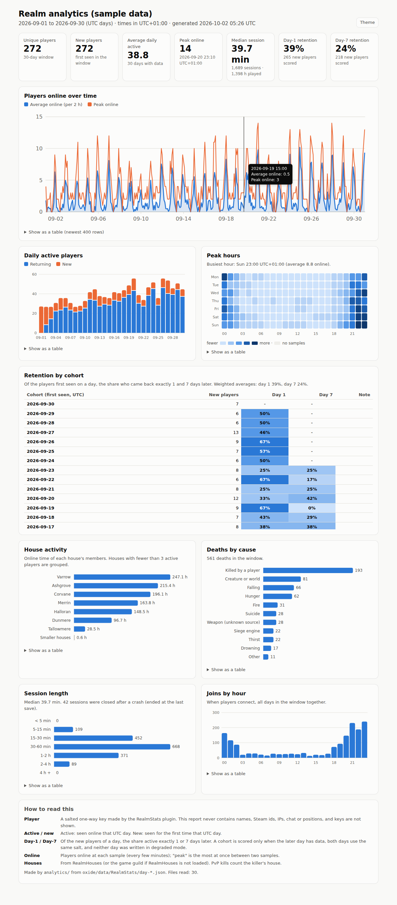

# RealmStats: privacy-friendly server analytics

`plugins/RealmStats.cs` (Oxide 2.0.3867, C# 3) keeps aggregate play statistics for an Ostreval server: how many people play, when they play, whether new players come back, how they die, and which houses are active. It writes them to rotating day files. The offline builder in [`analytics/`](../../analytics/README.md) turns those files into a single HTML dashboard.



*The screenshot uses made-up sample data (`analytics/tools/make-sample.js`), not a real server.*

Status: **compiles with 0 errors against the real 2.0.3867 DLLs, and is behaviour-tested against mocks (89 checks pass). It has never run on a live server.** See [What is UNVERIFIED](#what-is-unverified).

Nothing from RealmStats goes to the public Chronicle, so **no new Chronicle event types are needed**.

---

## What it records, and what it never records

| Recorded (per UTC day) | How |
|---|---|
| Active players | A **key** per player: the first 16 hex characters of `HMAC-SHA256(Salt, "player|" + SteamID64)`. |
| New players | Keys seen for the first time that day. This is what D1/D7 retention is computed from. |
| Sessions | Start time and length only. **There is no key on a session.** |
| Joins and leaves | Counts per UTC hour. |
| Concurrent players | Every `SampleMinutes` (default 5): the number online at the sample, plus the most online at once since the last sample. |
| Deaths by cause | Counts per cause: `pvp`, `suicide`, `fall`, `hunger`, `thirst`, `drowning`, `fire`, `explosion`, `siege`, `plague`, `out_of_bounds`, `creature`, `weapon`, `other`. |
| House activity | Per house: active keys, members' online seconds, sessions, deaths, PvP kills (credited to the killer's house). |

**Never recorded:** names, Steam ids, IP addresses, chat, positions, inventories, or who killed whom.

**The keys are pseudonymous, not anonymous.** With the salt, anyone could hash every Steam id and match the keys. The salt lives only in `oxide/config/RealmStats.json` on the server. It is generated with a cryptographic RNG the first time the plugin loads, and it must never be committed, pasted or shared. Treat the data folder as private server data too.

**Opting out.** `/stats optout` takes the player's key out of today's data at once. It also removes it from every kept day file, two files per 15-second tick, so that nothing stalls. From then on the player only counts in anonymous totals: concurrency, joins and leaves per hour, and death causes. Their sessions and house time are not recorded. To remember the choice, the plugin keeps the opted-out key in `state.json`. `/stats optin` reverses it, and the player then counts as a new player again.

**On the dashboard,** keys are never shown. Houses with fewer than 3 active players (`--min-house`) are grouped as "Smaller houses", so a one-person house does not reveal one person's play times.

---

## Commands

Everything is under `/stats`.

| Command | Who | What it does |
|---|---|---|
| `/stats` or `/stats help` | everyone | Help. Admins also see the admin commands. |
| `/stats privacy` | everyone | What is and is not recorded, and how long it is kept. |
| `/stats me` | everyone | The first 6 characters of your key, the day you were first seen, and how long data is kept. |
| `/stats optout` | everyone | Stop being counted by key, and scrub your key from kept days. Turn it off with `AllowOptOut: false`. |
| `/stats optin` | everyone | Undo the opt-out. |
| `/stats status` | `realmstats.admin` | Today's numbers: online, peak, active, new, sessions, joins, leaves, deaths, houses. Also the data health (OK or DEGRADED), the current file, how many day files are kept, the salt id, keys known, opt-outs, and scrub progress. |
| `/stats save` | `realmstats.admin` | Writes the files now. 30 s cooldown. |

Grant the admin permission in the server console: `oxide.grant user <name|id> realmstats.admin`.

Cooldowns: a player can use `/stats` once every 3 s, and can switch opt-out or opt-in once every 60 s. Admins skip the player cooldowns.

The first time a key is seen, the player gets one chat line about `/stats privacy` and `/stats optout` (`PrivacyNoticeOnFirstJoin`).

---

## Files

All files are under `oxide/data/RealmStats/` (Oxide `DataFileSystem`).

| File | Contents |
|---|---|
| `state.json` | The index of day files. First and last day seen per key, which `MaxTrackedPlayers` caps by dropping the least recently seen. Open sessions, for crash recovery and hot reload. The opt-out keys and the scrub queue. |
| `day-YYYY-MM-DD.json` | One file per UTC day (format below). On rollover, files older than `RetentionDays` are deleted, using the index (never a folder scan). |
| `day-YYYY-MM-DD-rN.json` | Written **instead of** a day file that exists but cannot be parsed. The damaged file is left exactly as it was. The dashboard merges both. |

Day file format (version 1):

```json
{
  "Version": 1, "Date": "2026-09-01", "Server": "realm-1", "SaltId": "3f9a12c0", "Degraded": false, "SampleMinutes": 5,
  "Active": ["<16 hex>", "..."], "New": ["<16 hex>"],
  "Sessions": [{ "S": 1788289200, "D": 3600, "E": "leave" }],
  "Joins": [24 counts by UTC hour], "Leaves": [24 counts],
  "Concurrency": [{ "T": 1788289200, "N": 3, "Max": 4 }],
  "Deaths": { "pvp": 2, "fall": 1 },
  "Houses": { "Varrow": { "Active": ["<16 hex>"], "Seconds": 7200, "Sessions": 3, "Deaths": 1, "Kills": 2 } },
  "Dropped": { "short_sessions": 1 }
}
```

The session end reason `E` is one of these:
- `leave`
- `shutdown`
- `recovered`: left open by a crash, and closed at the last save.
- `reconcile`: the player was gone from the game's own list at a sample.

`SaltId` is 8 hex characters of `SHA-256("realmstats-salt-id|" + salt)`. It tells the dashboard when the salt changed, so it never compares keys made with different salts. It does not reveal the salt.

### Corruption safety

- **The config cannot be parsed:** nothing is collected, and the config is **not** rewritten. Players are told stats are paused. Fix `oxide/config/RealmStats.json` and run `oxide.reload RealmStats`.
- **`state.json` cannot be parsed:** collection continues from memory, and every day written is marked `"Degraded": true`. Its new-player list is left empty, so the dashboard leaves those days out of retention. `state.json` is **never written**, and no day file is deleted or scrubbed until you fix or remove it and reload. `/stats status` shows `DEGRADED`.
- **A day file cannot be parsed:** it is kept unchanged, and the day continues in `day-...-r1.json`. Up to 50 recovery files can be made per day; after that collection stops.
- **The salt changes:** the plugin warns and restarts the first-seen table, the open sessions and the opt-outs, because old keys can never match again. The dashboard does not score retention across the change.

Writes go through Oxide's `WriteObject`. This is a plain overwrite, not an atomic replace. A crash during the write itself could truncate a file, and the next load would then use the recovery path above.

### Sessions across restarts

- **Clean shutdown** (`OnServerShutdown`): every open session ends, with reason `shutdown`.
- **Hot reload** (`oxide.reload RealmStats`): sessions stay open in `state.json`. Players still online carry on with their original start time and are not counted twice.
- **Crash:** on the next start, sessions left open end at the last heartbeat, which is written on every save, every 300 s by default. They are marked `recovered`, and capped at 2 days.

---

## Configuration (`oxide/config/RealmStats.json`)

| Key | Default | Range | Meaning |
|---|---|---|---|
| `Salt` | random 64 hex | at least 16 characters | The secret key for player hashes. It is generated on first load. A value containing `CHANGE` (for example `CHANGE_ME`) is replaced on load. Changing the salt resets retention history. **Back it up privately; never commit it.** |
| `ServerLabel` | `realm-1` | up to 32 characters | Written into each day file. Use it with `--server` when several servers share a folder. |
| `SampleMinutes` | 5 | 1-60 | The concurrency sample interval. |
| `RetentionDays` | 120 | 7-730 | Day files older than this are deleted. |
| `SaveIntervalSeconds` | 300 | 60-3600 | Also sets how far apart the crash-recovery heartbeats are. |
| `MinSessionSeconds` | 5 | 0-600 | Shorter sessions count as joins only (`Dropped.short_sessions`). |
| `HouseSource` | `auto` | `auto`, `realmhouses`, `guild`, `off` | `auto`: RealmHouses if it is loaded, otherwise the game guild name. |
| `TrackDeaths` / `TrackHouses` | true | | Turn either part off. |
| `AllowOptOut` | true | | Enables `/stats optout`. |
| `PrivacyNoticeOnFirstJoin` | true | | One chat line the first time a key is seen. |
| `MaxTrackedPlayers` | 200000 | 1000-1000000 | The first-seen table. When it is full, the 10 % seen least recently are dropped, and those players count as new again if they return. |
| `MaxActivePerDay` | 50000 | 100-500000 | Caps the active and new lists (also per house). |
| `MaxSessionsPerDay` | 50000 | 100-500000 | Caps the sessions per day. |
| `MaxHousesPerDay` | 100 | 1-1000 | Further houses are folded into `(other)`. |
| `MaxOptOuts` | 100000 | 10-1000000 | Past this, the oldest opt-out is forgotten. |
| `DeathDedupeSeconds` | 3 | 0-60 | One death per victim inside this window. |
| `CommandCooldownSeconds` / `AdminSaveCooldownSeconds` / `OptToggleCooldownSeconds` | 3 / 30 / 60 | | Cooldowns. |

Anything a cap drops is counted in the day's `Dropped` map. The dashboard lists it under **Data notes**, apart from short sessions.

---

## How it works (and what each part rests on)

Tags are as in `docs/oxide-rok-api.md`.

| Part | Rests on |
|---|---|
| Joins, leaves, sessions | `OnPlayerConnected` / `OnPlayerDisconnected (Player)`, core-dispatched, with the server player filtered [SRC `ReignOfKingsHooks.cs:90-154`]. At each sample the plugin also checks `Server.ClientPlayers` [ASM] and closes or opens any session a missed hook left wrong (`reconcile`). |
| Concurrency | The plugin's own online table, which is kept in step with `Server.ClientPlayers`. One 15 s timer (`timer.Every`) drives sampling, saving, rollover and scrubbing. |
| Deaths | `OnEntityDeath(EntityDeathEvent)` [OPJ L188]. It is RB 1, and RealmStats **always returns null**. The victim is `evt.Entity.Owner` when `evt.Entity.IsPlayer`. The killer is `evt.KillingDamage.DamageSource.Owner`, and the cause flags are `evt.KillingDamage.DamageTypes` [ASM]. The `DamageType` members (`Suicide=1`, `Impact=2`, `Melee=4`, ... `Falling=0x800`, `Hunger=0x40000`, `Thirst=0x200000`, ...) were read from the decompiled shipped DLL. A kill by another player is `pvp`; otherwise the most specific environmental flag wins. A non-player damage source counts as `creature`. |
| Houses | `RealmHouses.Call("GetHouse", steamIdString)` returns a string. It is the non-public API in `plugins/RealmHouses.cs`, reached through `[PluginReference]`. Otherwise the plugin uses `PlayerExtensions.GetGuild().Name` [ASM]. Names are cleaned (control characters and `[]<>` removed, at most 48 characters). The house of each online player is checked again at every sample. |
| Hashing | `System.Security.Cryptography.HMACSHA256`, `SHA256` and `RandomNumberGenerator` from mscorlib. The compile check uses the .NET 2.0/3.5 reference assemblies, and `System.Security.Cryptography` is on Oxide's RoK namespace whitelist (`ReignOfKingsExtension.cs:63-74`). |
| Files | `Interface.Oxide.DataFileSystem.ExistsDatafile / ReadObject / WriteObject / DeleteDataFile` [SRC Oxide.Core `DataFileSystem.cs`; the names are present in the shipped `Oxide.Core.dll`]. The plugin calls `ExistsDatafile` before `ReadObject`, because `ReadObject` creates a missing file. |

Cross-plugin API (non-public, through `Call`): `GetStatsSummary()` returns `Dictionary<string, object>` with the keys `date`, `online`, `peak`, `active`, `new`, `sessions`, `houses` and `degraded`.

---

## Building the dashboard

```powershell
node analytics\bin\realm-analytics.js --data "G:\RealmTest\server\oxide\data\RealmStats" --out "$env:USERPROFILE\Desktop\realm-stats.html" --tz +01:00
```

The CLI only reads the data folder and refuses to write inside it. It needs Node 18 or newer and nothing else. See [`analytics/README.md`](../../analytics/README.md) for every option.

---

## Smoke test

Do this after section C of `docs/smoke-test.md` (Oxide and plugins working), on the local test copy, with one or two clients.

1. `.\Deploy-Plugins.ps1`, then watch the console for `RealmStats` loading with no errors. **Pass:** `oxide/config/RealmStats.json` exists, and its `Salt` is 64 hex characters.
2. `oxide.grant user <you> realmstats.admin`.
3. Join with the client. **Pass:** one chat line about `/stats privacy`. `oxide/data/RealmStats/` holds `state.json` and `day-<today UTC>.json` once a save happens (run `/stats save`).
4. `/stats status`. **Pass:** online 1, active 1, new 1, joins 1, data OK, salt id 8 hex characters.
5. Open the day file in a text editor. **Pass:** no name and no Steam id anywhere. Search for your SteamID64 and for your name.
6. Stay 6 minutes, then `/stats save`. **Pass:** `Concurrency` has at least one entry with `N: 1`.
7. Die by falling, by starving if practical, and to a second player if you have one. **Pass:** `Deaths` shows `fall`, then `hunger`, and then `pvp` with the second player. **Record which cause each real death produced.**
8. If RealmHouses is loaded: found a house (`/house found ...`), wait for one sample, then save. **Pass:** `Houses.<name>.Active` holds your key and `Seconds` grows.
9. `oxide.reload RealmStats` while you are online, then leave, then save. **Pass:** one `leave` session whose start is your original join time.
10. While online, end `Server.exe` from Task Manager (a crash), start the server again, and save. **Pass:** a `recovered` session ending at about the last save.
11. `/stats optout`, wait 30 s, then save. **Pass:** your key is gone from every day file. `/stats me` says you opted out.
12. Copy `oxide/data/RealmStats` somewhere else, run the dashboard CLI on the copy, and open the HTML. **Pass:** it opens offline, and the numbers match `/stats status`.
13. Corruption check: stop the server, add a stray `{` at the start of `state.json`, start it, and join. **Pass:** the console shows the error, `/stats status` says DEGRADED, and `state.json` is unchanged after `/stats save`. Restore the file afterwards.

---

## What is UNVERIFIED

- **Everything at run time.** The plugin compiles against the real DLL metadata and passes the mock tests (`analytics/plugin-tests/run.sh`). It has not run inside Reign of Kings.
- **Which `DamageType` flags the game sets for each kind of death,** and whether creature attacks carry a non-player `DamageSource`. The mapping is a reasoned guess (smoke-test step 7).
- **Whether `OnEntityDeath` fires once per death.** The 3 s dedupe guards against repeats. Also unverified: whether it fires for a player's sleeping body after logout, and whether that body counts as `IsPlayer`.
- **That `HMACSHA256`, `SHA256` and `RandomNumberGenerator` work under the server's Unity 5.1 Mono runtime.** They are standard mscorlib types, but this was not run.
- **`GetGuild()` for a player with no guild:** null is expected.
- **Timer drift:** `timer.Every(15)` is assumed to keep up. Samples are aligned to clock buckets, so a late tick only delays a sample and does not shift it.
- **Data paths:** whether Oxide uses `oxide\data` or `Saves\oxide\data` on the owner's server (the same open item as the rest of the repo).
- The mock tests serialise with `System.Text.Json` (field names), not Oxide's Newtonsoft. Both write public fields under their own names, so the files should match. Check the first real day file against the format above.
