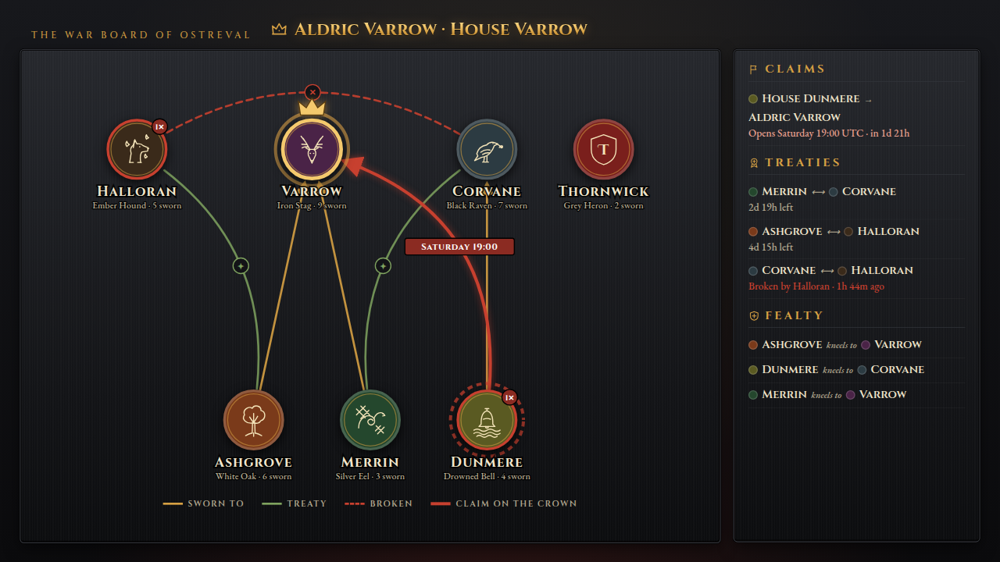

# Realm Stream Scenes (`streamkit/`)

Five extra OBS browser-source scenes for the Chronicle of Ostreval. They sit next to the Chronicle's own `/overlay` and use the same iron, parchment and ember-gold look and the same house colours.

| Scene | URL | What it shows |
|---|---|---|
| **War Board** | `/war-board` | Every house as a node with its drawn sigil. Gold arrows are liege lines, green arcs are treaties, red dashed arcs are treaties broken in the last 24 hours, and red arrows are declared claims on the crown, tagged with their window. A side ledger lists claims (with time to the window), treaties (time left) and fealty. The crown house glows, a claiming house has a turning red ring, and oathbreaker/treaty-breaker marks show as a red badge. Nodes glide to new places when fealty changes. |
| **Throne Room** | `/throne-room` | A coronation lower third. A medallion drops in and turns, the new monarch's sigil draws itself stroke by stroke, the name plate unrolls with the house words and the predecessor. An abdication gets a darker "The crown falls" plate. |
| **Breaking News** | `/breaking-news` | A queue of alerts for betrayals and war: oath and treaty breaking, broken truces, claims, rebellions, abdications, blood claims, accusations and trials by combat. Urgent alerts (rebellion, abdication, oath/treaty/truce broken) jump the queue. A bar drains while each alert holds. |
| **Countdown** | `/countdown` | Time to the next thing worth waiting for: a live rebellion's end, a declared claim's window, the next Lawful Hours, the next realm event (Crown Night, the Royal Tournament, the King's Hunt, the Truce), or your own moment. |
| **Starting Soon** | `/starting-soon` | A full-screen holding scene: title, an optional countdown, the reigning crown, the house banners, the next Lawful Hours and a rotating "Lately in the realm" line. |



More screenshots (all rendered from `fixtures/` by `tools/screenshots.mjs`): `docs/img/stream-throne-room.png`, `stream-breaking-news.png`, `stream-countdown.png`, `stream-countdown-compact.png`, `stream-starting-soon.png`, `stream-war-board-dunmere.png`.

## Running it

You need Node 20 or newer. Nothing to install: the server uses only Node built-ins.

```powershell
# 1. The chronicle service must already be running (chronicle\server.js on 127.0.0.1:8787).
# 2. Start the scenes server:
cd <repo>\streamkit
node server.js
#    or, with your server's schedule (see "Schedule" below):
node server.js --schedule schedule.json
```

Then in OBS add a **Browser** source per scene with URL `http://127.0.0.1:8790/<scene>`, width `1920`, height `1080`. Leave the custom CSS empty. Overlays are transparent already. Open `http://127.0.0.1:8790/` in a browser for a list of the scenes.

### Why a second server?

The scenes need `/api/state` and `/api/events` from the chronicle. The chronicle sends no CORS headers and its CSP only allows its own origin, so a page served from anywhere else (or opened as a `file://`) cannot read it. `server.js` serves the scenes **and** relays those two endpoints, so the browser sees one origin. The relay:

- forwards only `GET /api/state` and `GET /api/events`, rebuilding the query from validated `since` (integer) and `limit` (1 to 500) values. Nothing else reaches the chronicle.
- turns a missing, slow (4 s timeout) or broken chronicle into a `502` JSON error. The scenes keep their last data and show a small "The ravens are late" chip after three failed polls.
- passes on the chronicle's `X-Realm-Data-Warning` header.

### Loopback only

- It refuses to start (exit code 2) if `--host` is anything other than `127.0.0.1`, `::1` or `localhost`. There is no override. OBS runs on the same PC.
- The upstream (`--upstream`) must be `http://` on a loopback address.
- Requests whose `Host` header is not a loopback name get `403`. This blocks DNS-rebinding pages from reading the relay.
- Only `GET` and `HEAD` are accepted. Static files are confined to `public/`.

| Option | Env var | Flag | Default |
|---|---|---|---|
| Port | `STREAMKIT_PORT` | `--port` | `8790` |
| Bind address | `STREAMKIT_HOST` | `--host` | `127.0.0.1` (loopback only) |
| Chronicle | `REALM_CHRONICLE_URL` | `--upstream` | `http://127.0.0.1:8787` |
| Schedule file | `STREAMKIT_SCHEDULE` | `--schedule` | none (plugin defaults) |
| Fixture data | `STREAMKIT_FIXTURES` | `--fixtures <dir>` | off |
| Demo events | | `--demo <seconds>` | off |

### Without a game server

```bash
npm run fixtures   # serves fixtures/ (state.json, events.json) instead of the chronicle
npm run demo       # same, plus one new event from fixtures/demo.json every 12 s
```

Demo mode is the easiest way to position the scenes in OBS: it plays an oathbreaking, a treaty, a rebellion, an abdication, a coronation and so on, in a loop, so every animation fires. Demo events only exist in memory.

## URL options

Every scene:

| Param | Effect |
|---|---|
| `scale=1.25` | Enlarge or shrink the scene's content inside the 1920x1080 stage (0.25 to 4). Lower thirds scale from their corner. |
| `transparent=0` / `transparent=1` | Draw a backdrop, or not. Overlays default to transparent; Starting Soon defaults to its backdrop. |
| `house=Varrow,Corvane` | House filter (a leading "House " is ignored). See each scene below for what it does. |
| `motion=0` | Reduced motion (see below). The OS "reduce motion" setting does the same. |
| `poll=3` | Seconds between chronicle polls (1 to 60). |
| `replay=N` | On load, play the last N matching events (Throne Room, Breaking News). For positioning. |
| `now=<ISO time>` | Preview only: freezes the scene's clock and stops polling (add `live=1` to keep polling). Used by the screenshots. |

Per scene:

| Scene | Param | Effect |
|---|---|---|
| War Board | `house=` | Show the named houses plus every house they touch through fealty, treaties or a claim on the crown. |
| | `ledger=0`, `title=0` | Hide the side ledger or the title row. |
| | `windows=`, `offset=` | Rebellion windows, for claim window lengths (see Schedule). |
| Throne Room | `mode=always` | Keep the reigning monarch on screen; re-animates on every coronation. Default `mode=event`: only appears for a coronation, for `hold` seconds. |
| | `hold=14` | Seconds a plate stays up (3 to 120). |
| | `position=left\|center\|right` | Where the lower third sits. |
| | `abdication=0` | Do not show "The crown falls" plates. |
| | `house=` | Only coronations of those houses (abdications are skipped while a filter is set). |
| Breaking News | `hold=10`, `max=8` | Seconds per alert; most alerts kept waiting (older plain alerts are dropped first). |
| | `types=oath_broken,treaty_broken` | Override the event types shown (any Chronicle event type). |
| | `position=top\|bottom` | Where the alert drops in. |
| | `house=` | Only events whose title, detail or actors name one of the houses. |
| Countdown | `for=auto\|rebellion\|event\|custom` | What to count to. `auto`: a custom time, then a live rebellion or realm event, then a declared claim, then whichever of the next Lawful Hours or realm event is sooner. |
| | `at=<ISO>` or `in=15m` | A custom moment (`in` takes `90`, `15m`, `1h30m`, `2d`). With `label=` and `sub=` for the text. |
| | `layout=compact` | A small corner badge (top right) in place of the big centre panel. |
| | `windows=`, `events=`, `offset=` | Override the schedule (see below). |
| | `house=` | Only claims by those houses count. |
| Starting Soon | `title=`, `sub=` | The headline and the line under it. |
| | `in=` / `at=` | Show a countdown. |
| | `banners=6` | How many house banners (0 to 8). The crown house goes first. |

### Reduced motion

With `motion=0`, or when the OS asks for reduced motion (OBS's Chromium follows the Windows "Show animations" setting, **UNVERIFIED** on every OBS version), scenes still change but only by fading. Turning medallions, drawing sigils, embers, fog, shaking alerts, pulsing rings and gliding nodes are all switched off; animations jump to their end state. The Breaking News timer bar still drains, because it tells the viewer how long the alert stays. `tools/screenshots.mjs` checks this in Chromium for every scene.

## Schedule

The chronicle API does not publish the rebellion windows or the realm-event calendar, so the Countdown, Starting Soon and the War Board's claim lengths need them from you. Without a schedule they use the **plugin defaults**:

- Rebellion windows (`CrownAndConsequences`): Wednesday 19:00 for 60 min and Saturday 19:00 for 90 min, realm time = UTC + `UtcOffsetHours` (default 0).
- Realm events (`RealmEvents`, always UTC): Crown Night Saturday 19:00 (90 min), the Royal Tournament Friday 19:00 (60), the King's Hunt Wednesday 21:00 (60), the Truce of the Realm Sunday 12:00 (240).

If you changed either config, copy `schedule.example.json` to `schedule.json` (it is not tracked; it holds no secrets), copy the values from `oxide/config/CrownAndConsequences.json` and `oxide/config/RealmEvents.json`, and start the server with `--schedule schedule.json`. Or put it in the URL: `windows=Wednesday@19:00+60,Saturday@19:00+90&offset=0&events=Crown Night=Saturday@19:00+90;Royal Tournament=Friday@19:00+60`.

A declared claim's window comes from the claim itself ("The rebellion opens Saturday 19:00 UTC."), and a live rebellion's end from "contested until 20:30 UTC", so those are right even without a schedule.

## How the scenes read the chronicle

The API serves the state (`king`, `house`, `houses[{name, sigil, liege, members}]`) and the event feed. Treaties, claims and marks are rebuilt from the event wording the plugins write (`public/assets/model.js`):

| Event | Wording parsed (from the plugin source) |
|---|---|
| `treaty_signed` | `House A and House B sign a treaty` + `The treaty holds for N days` (RealmHouses). No term: 7 days (`TreatyDefaultDays`). |
| `treaty_broken` | `House A breaks its treaty with House B` |
| `oath_broken` | `House A renounces its oath to House B` |
| `claim_declared` | `House A claims the crown` + `against <king> of <house>.` + `The rebellion opens <Day> HH:MM UTC.` (CrownAndConsequences) |
| `rebellion_started` / `_ended` | `House A rises` + `until HH:MM UTC` / `The rebellion of House A ends` |
| `coronation` | `<king> of <house> takes the throne` (and the older `<king> takes the throne` + `House X now holds the crown`) |
| `event_started` / `_ended` | `<Name> begins` / `<Name> ends`, `is cancelled`, `is called off` (RealmEvents) |

If a plugin changes its wording, the matching edge or countdown silently disappears; nothing breaks. A claim the plugin never closed lapses 10 minutes after its window, and a treaty disappears when its term ends. Liege lines come straight from the state, so they are always current. The War Board only sees what the last 500 events say: a treaty signed more than 500 events ago is not drawn.

House colours use the same name hash as the Chronicle overlay (`chronicle/public/assets/common.js`), and `npm test` fails if they drift. Sigils are line art drawn for this project, chosen by keyword from the house's sigil text (stag, oak, raven, bell, hound, eel, and a few synonyms). Any other sigil gets a shield with the house's initial.

## New Chronicle event types

None. The scenes only read existing types, so there is no `EVENTS.json` here.

## Tests and screenshots

```bash
npm test                         # node:test: model (fixtures) + server (relay, loopback, traversal, demo)
node tools/screenshots.mjs       # Playwright + Chromium: browser checks, then docs/img/stream-*.png
node tools/screenshots.mjs --check-only
```

The screenshot script is a dev tool. Web fonts load only if Chromium can reach Google Fonts (set `SHOTS_PROXY=1` to route through `HTTPS_PROXY`); otherwise the fallback fonts are used. Playwright is not a dependency; it looks for `PLAYWRIGHT_MODULE`, then `playwright`, then `/opt/node-tools/node_modules/playwright`, and uses `CHROMIUM` (default `/opt/pw-browsers/chromium`). Besides writing the PNGs it fails if any scene throws, a request fails, a scene never becomes ready, transparency is wrong, a house filter shows the wrong nodes, reduced motion leaves an animation running, or a live demo event never reaches Breaking News.

## Files

```
server.js                     loopback static server + chronicle relay + fixtures/demo mode
public/<scene>.html           the five scenes; index.html lists them
public/assets/model.js        pure data model (war board, layout, countdown, alert queue, params). Tested in Node.
public/assets/kit.js          browser helpers: stage scaling, polling, dye, icons
public/assets/sigils.js       sigil line art
public/assets/kit.css         shared tokens; <scene>.css / <scene>.js per scene
fixtures/                     state.json + events.json in the API's shape, demo.json for --demo
schedule.example.json         schedule template (the plugin defaults)
test/                         node:test suites
tools/screenshots.mjs         Playwright checks + docs/img/stream-*.png
```

## Not verified yet

- **UNVERIFIED in OBS itself.** The scenes were checked in Playwright's Chromium (build 1194) only. OBS's browser source is CEF/Chromium too, so they should behave the same, but nobody has tried them in OBS on Windows yet.
- **UNVERIFIED against a live server.** The event wording above is read from the plugin source, not from a running game server.
- The Google Fonts (Cinzel, EB Garamond) need internet. Offline, the scenes fall back to Palatino or Georgia.
